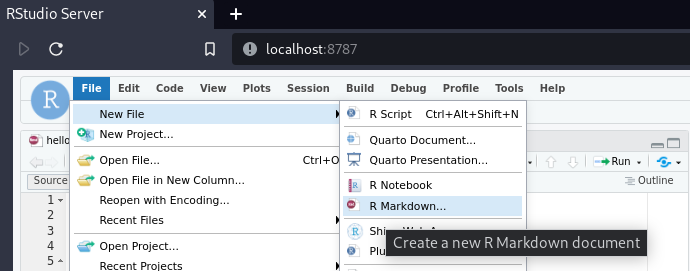
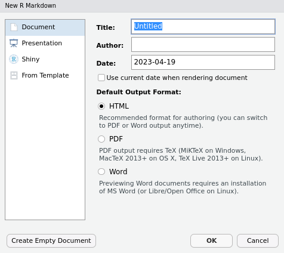
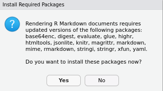
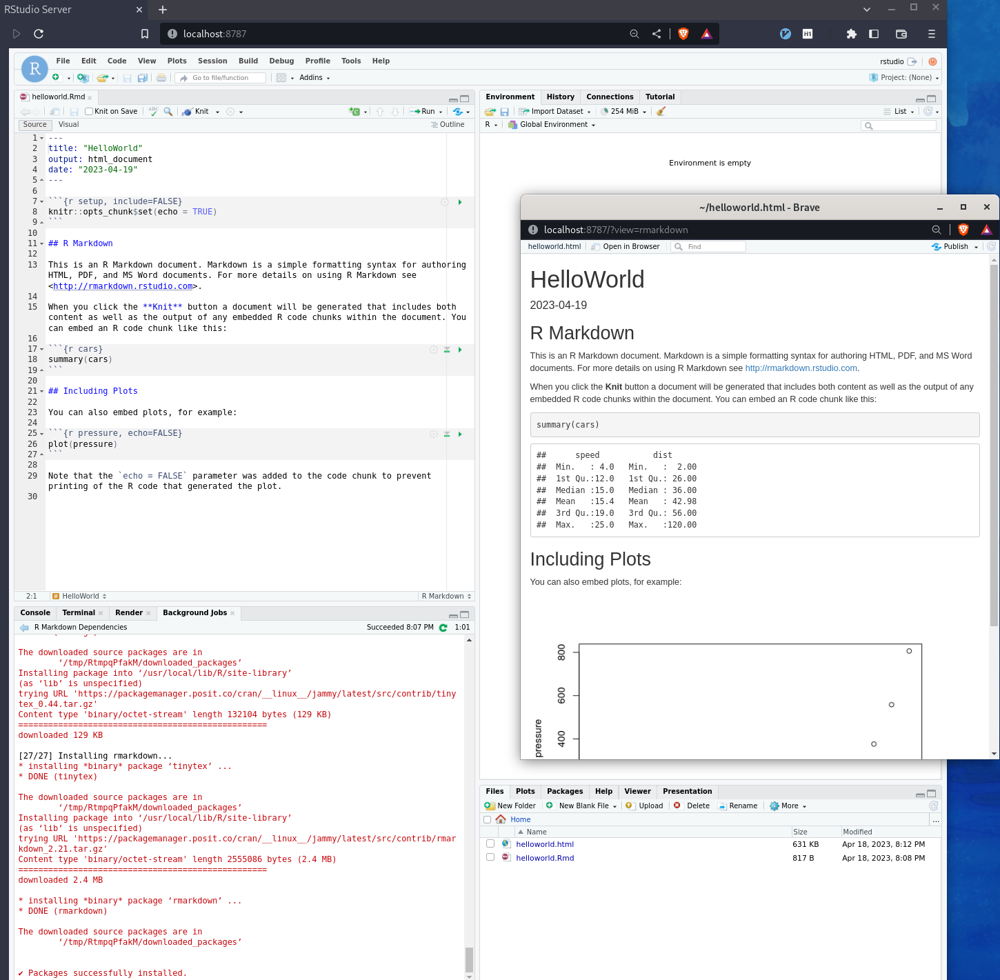

# Rocker - Getting Started Sandboxed

If you have installed `RStudio` as a native software package you can skip the `docker` related section.

If you use `docker` then the instructions start the `docker` container in a `sandbox`, i.e. it is
**an isolated setup from your host and does not share folders on the host**. This gives you the most protection
and is good for trying it out but not adequate if you want to use it frequently.

For more **advanced setup appropriate for frequent use** you might want to check:

- [getting-started.md](../getting-started.md)
- [Launching RStudio in Docker](https://jsta.github.io/r-docker-tutorial/02-Launching-Docker.html)
- [Running RStudio Server with Docker - Dave Tang's blog](https://davetang.org/muse/2021/04/24/running-rstudio-server-with-docker/)

## Launch RStudio As Docker Container

In your terminal run:

```bash
docker run --rm -ti -p 8787:8787 rocker/rstudio
```

The output should looks similar to what is shown below, note the password:

```ansi
If you want to set your own password, set the PASSWORD environment variable. e.g. run with:
docker run -e PASSWORD=<YOUR_PASS> -p 8787:8787 rocker/rstudio
```

If you want to explicitly set the password run it as follows where you replace `your_password`
with the password you like to use:

```bash
docker run --rm -ti -p 8787:8787 -e PASSWORD=your_password rocker/rstudio
```

Launch your web browser and open the page: <http://localhost:8787>

The login user name is `rstudio` and the password is what you noted down earlier.

After the login you should see something like:



## Create R Markdown Document

Go go menu `File | New File | R Markdown` like shown below:

Press `Enter` and fill out the dialogue:



Click on the `Knit` icon:

Accept the installation of the required `R` package. The prompt looks like:



The installation may take a few minutes, i.e. it took 1.09 minutes on my system.

The result should look like:


