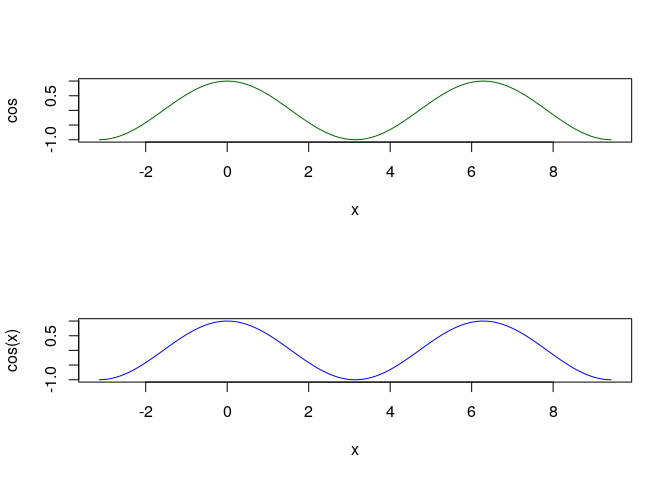
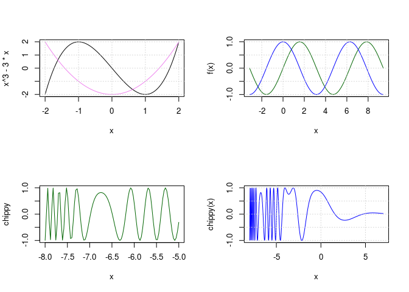
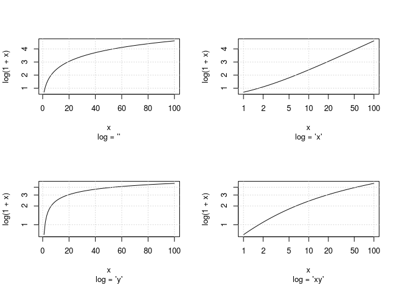

Text Formatting, Math Mode, Plots and Curves
================
Marco Malva
2023-05-15

- <a href="#overview" id="toc-overview">Overview</a>
- <a href="#lists" id="toc-lists">Lists</a>
  - <a href="#bullet-list" id="toc-bullet-list">Bullet List</a>
  - <a href="#number-list" id="toc-number-list">Number List</a>
- <a href="#text-style" id="toc-text-style">Text Style</a>
  - <a href="#italic" id="toc-italic">Italic</a>
  - <a href="#bold" id="toc-bold">Bold</a>
  - <a href="#inline-code" id="toc-inline-code">Inline Code</a>
  - <a href="#highlight-text" id="toc-highlight-text">Highlight Text</a>
- <a href="#highlight-block" id="toc-highlight-block">Highlight Block</a>
- <a href="#math-mode" id="toc-math-mode">Math Mode</a>
  - <a href="#superscript" id="toc-superscript">Superscript</a>
  - <a href="#subscript" id="toc-subscript">Subscript</a>
  - <a href="#mathematical-symbols"
    id="toc-mathematical-symbols">Mathematical Symbols</a>
  - <a href="#greek-letters" id="toc-greek-letters">Greek Letters</a>
  - <a href="#math-block" id="toc-math-block">Math Block</a>
  - <a href="#example---anova-hypotheses"
    id="toc-example---anova-hypotheses">Example - ANOVA Hypotheses</a>
- <a href="#math-curve" id="toc-math-curve">Math Curve</a>
  - <a href="#curve-vs-plot" id="toc-curve-vs-plot">Curve vs Plot</a>
  - <a href="#functions" id="toc-functions">Functions</a>
  - <a href="#log-scale" id="toc-log-scale">Log Scale</a>
- <a href="#rstudio-editor-modes" id="toc-rstudio-editor-modes">RStudio
  Editor Modes</a>
- <a href="#appendix" id="toc-appendix">Appendix</a>
  - <a href="#session-info" id="toc-session-info">Session Info</a>

## Overview

This is an R Markdown document about some basics on text formatting,
text highlighting, math mode, plots and curves. It is basically all one
needs to know to get started writing some simple STEM papers in
RMarkdown.

Most of the effects are only visible in the knitted output or the
“Visual” editor display. The “Source” editor indicates some of it by
changing font color and such.

## Lists

### Bullet List

A bullet list can be created by asterisk (`*`) or dash (`-`) followed by
a space. As you can see in the outline

- one hash tag (`#`) followed by a space is a **header style 1**,
- two hash tag (`#`) followed by a space are a **header style 2**,
- three hash tag (`#`) followed by a space are a **header style 3**,
- and so forth

> It seems that using dashes instead of asterisk is the more modern way.

### Number List

A number list is created by putting `1.` in the front:

1.  item 1
2.  item 2
3.  item 3
4.  item 4

The knitted text will show correct item numbers.

> If one has `canonical: true` the list numbers change on every save
> which is great as one must no longer wait for the knit result to see
> the actual, current numbers but it also means that the text is changed
> automatically on every save.

## Text Style

### Italic

One gets *italic* words or *italic word sequences* by surrounding the
words by one asterisk (`*`).

### Bold

You get **bold** words or **multiple bold words** by surrounding the
words by two asterisk (`*`).

### Inline Code

Anything you place between surrounding backtick (symbol left of the 1 on
the US keyboard) is formatted with grey background and in a
`Mono Space Font`. This is the same character that is used three times
to start a code chunk. [Backtick -
Wikipedia](https://en.wikipedia.org/wiki/Backtick#:~:text=The%20backtick%20%60%20is%20a%20typographical,%2C%20grave%2C%20or%20grave%20accent.&text=The%20character%20was%20designed%20for,overtyping%20it%20atop%20that%20letter.)

A side effect is that anything surrounded by backtick is basically not
parsed or interpreted in any way. For example, if one places an asterisk
`*` in backtick and another one `*` then the text between these is *not
italic*. In the “Source” editor this is indicated by **not changing**
the font color to blue for such surrounded asterisk

### Highlight Text

In some markdown dialects one also have ==words marked as if highlighted
by a marker== by placing the text between two equal (`=`) signs.

> This does not work with RMarkdown.

## Highlight Block

Already used a couple of times is the greater sign (`>`) followed by a
space to mark a line or block as a highlight:

> A single line highlight

One can create entire blocks:

> first line of the block  
> second line of the block  
> note, that in order to force a new line the line ends with a backslash
> character (`\`)  
> last line of the block

In the “Visual” editor these blocks are highlighted by using a green
font.

## Math Mode

One can switch to math mode by surrounding text with a dollar sign
(`$`). This basically means that $Latex$ mode which is good for writing
mathematical equations and such. Some web pages allow to copy formula
with right click “copy as Latex”.

This is called the **inline math mode** as opposed to the **math bock**.
A math block is either a code block marked as math or a code block
formed by two dollar signs instead of three backtics.

For most of the inline math mode if one hovers with the mouse the
display will show an approximation of the final output.

### Superscript

A superscript example is `x` squared: $x^2$.

To place an expression as exponent surround it by curly brackets `{` and
`}`: $e^{2x-5}$

### Subscript

A subscript example is: $H_0$.

Use curly brackets for longer subscripts: $x_{i-1}$

### Mathematical Symbols

For a list of mathematical symbols see for example:

- for mathematical symbols see: [List of LaTeX mathematical symbols -
  OeisWiki](https://oeis.org/wiki/List_of_LaTeX_mathematical_symbols)
- [The Comprehensive LaTeX Symbol
  List](http://tug.ctan.org/info/symbols/comprehensive/symbols-a4.pdf)

This includes symbols like the right arrow $\Rightarrow$ for logical
conclusions, the infinity $\infty$ symbol, the union symbol $\cup$, or
the approximate symbol $\approx$.

### Greek Letters

For a list of Greek letters see for example:

- [List of Greek letters and math symbols - Overleaf, Online LaTeX
  Editor](https://www.overleaf.com/learn/latex/List_of_Greek_letters_and_math_symbols)

For example the angle alpha $\alpha$, beta $\beta$, and so forth. Note
that $\delta$ is the lower case delta and $\Delta$ is the upper case
delta. Then there is $\epsilon$, $\iota$, $\lambda$, $\mu$, $\sigma$,
and $\Omega$.

### Math Block

One can create a math block with two dollar signs at the beginning and
at the end:

$$
a \cdot x^2 + b \cdot x + c = 0  \\
\Rightarrow x = \frac{-b \pm \sqrt{b^2 - 4 \cdot a \cdot c}}{2 \cdot a} \\
\Rightarrow x = \frac{-b \pm \sqrt{b^2 - 4ac}}{2a} \\
\Rightarrow x = -\frac{b}{2a} \pm \frac{\sqrt{b^2 - 4ac}}{2a}
$$

Similar to the “highlight block” or general text the backslash at tend
of the line is used to force a new line.  
In case of math blocks one must use two consecutive backslash characters
instead of one, i.e. `\\` instead of just `\`.  
As shown here a single backslash also works as a new line in normal
text.

### Example - ANOVA Hypotheses

The ANOVA Hypotheses is a good example for subscript, Greek letters and
bold font style.

If we are comparing the means ($\mu_i$) of *k* populations, where
*k\>2*, the **null and alternative hypotheses** of a ANOVA are:

- $H_0$ : The mean ($\mu_i$) of **all** groups are **equal**
  ($\mu_1 = \mu_2 = ... = \mu_k$)  
- $H_A$ : At **least one** group mean ($\mu_i$) is **different**
  ($\mu_i \neq \mu_j$ for some $i$ and $j$ where $i \neq j$)

## Math Curve

One can use a R code block with the R functions to plot mathematical
functions with the help of:

- `curve()` to plot a mathematical functions,
- `TeX()` function to render the equation nicely,
- `grid()` to add a grid, and
- `abline()` to add lines to the plot
- set parameter `lwd` for the line width
- set parameter `lty` for the line type (dashed, dotted, etc.)

As an example find the plot of $f(x) = 3x^2 + 6x -1$ below. By setting
`echo=TRUE` the code block itself is shown and not just its output
(function plot):

``` r
curve(3*x^2 + 6*x - 1, from=-3, to=1, ylab = "y", main=latex2exp::TeX(r'($f(x) = 3x^2 + 6x -1$)'), lwd=3, lty=3)
grid()
abline(h=0, col="blue", lwd=2, lty=6)
abline(v = -1, col="blue", lwd=2, lty=6)
```

<!-- -->

The $-\frac{b}{2a}$ gives the $x$ value of the extreme point, that is
the $x$ coordinate of the lowest or highest point of the U shaped square
polynomial. It sits right in the middle between the two roots. The
horizontal distance to the roots is $\frac{\sqrt{b^2 - 4ac}}{2a}$.

As for adding lines to a plot see:

- [abline R function : An easy way to add straight lines to a plot using
  R software - Easy Guides - Wiki -
  STHDA](http://www.sthda.com/english/wiki/abline-r-function-an-easy-way-to-add-straight-lines-to-a-plot-using-r-software#add-an-horizontal-line)

### Curve vs Plot

Taken from the build-in help that one can read when typing `?curve` +
`[ENTER]` in the console:

``` r
op <- par(mfrow = c(2, 1))
## simple and advanced versions, quite similar:
plot(cos, -pi,  3*pi, col = "darkgreen")
curve(cos, xlim = c(-pi, 3*pi), n = 1001, col = "blue")
```

<!-- -->

``` r
par(op)
```

### Functions

And more from the help, showing how to create functions and reference
them:

``` r
op <- par(mfrow = c(2, 2)) # use 2x2 plot layout, keep old setting in op
curve(x^3 - 3*x, -2, 2)
curve(x^2 - 2, add = TRUE, col = "violet")  # adding second curve to the plot
grid() # adding grid

## simple and advanced versions, quite similar:
plot(sin, -pi,  3*pi, col="darkgreen", ylab = "f(x)")
curve(cos, xlim = c(-pi, 3*pi), n = 1001, col = "blue", add = TRUE)
grid()

chippy <- function(x) sin(cos(x)*exp(-x/2))
plot (chippy, -8, -5, col="darkgreen")
curve(chippy, -8, 7, n = 2001, col="blue")
grid()
```

<!-- -->

### Log Scale

``` r
op <- par(mfrow = c(2, 2)) # use 2x2 plot layout, keep old setting in op

# demonstrate log x/y scale
for(ll in c("", "x", "y", "xy")) {
   curve(log(1+x), 1, 100, log = ll, sub = paste0("log = '", ll, "'"))
   grid()
}
```

<!-- -->

``` r
par(op) # reset to old setting
```

## RStudio Editor Modes

In case you haven’t notice there are two buttons “Source” and “Visual”
at the top left right below to the left of the the “Knit” icon.

These buttons can be clicked to toggle between the “source” and the
“visual” view. the “source” view is the default, easier on the computer
resources, renders faster, but is also less visually appealing and
accurate. The “Visual” mode is close to how the document will render as
knitted HTML but it is also more CPU intensive and depending on your
computing power may feel a little sluggish.

> Note that switching between the modes will remove new lines and can
> lead to  
> very long lines in the document when looked at in the “source” mode.

I personally found that to be irritating as keeping lines from getting
too long has certain advantages when navigating text files with other
tools or for tracking changes with version control. There is a reason
why markdown basically ignores line breaks w/o empty lines. this way one
can keep line length nicely capped at 80 or 120 character which works
well with a great many set of tools while not impacting the flow of the
rendered output. One can avoid some of the issues by enabling the editor
options `wrap: 80` and `canonical: true`. Those force new line wraps at
column 80 and keep the style the same between the two editor modes.
Note, that now anytime one saves the RMarkdown document long lines will
be force wrapped.

> Overall, I think **it is best to stay away** from the “Visual” editor
> mode.

The YAML options related to this are:

``` yaml
editor_options:
  markdown:
    wrap: 80
    references: 
      location: block
    canonical: true
```

See also:

- [Exploring RStudio’s Visual Markdown Editor -
  Posit](https://posit.co/blog/exploring-rstudio-visual-markdown-editor/)
- [Visual R Markdown - Markdown
  Formats](https://rstudio.github.io/visual-markdown-editing/markdown.html#line-wrapping)

## Appendix

### Session Info

The following software was used to render this RMarkdown document:

``` r
sessionInfo()
```

    ## R version 4.2.2 (2022-10-31)
    ## Platform: x86_64-pc-linux-gnu (64-bit)
    ## Running under: Ubuntu 22.04.2 LTS
    ## 
    ## Matrix products: default
    ## BLAS:   /usr/lib/x86_64-linux-gnu/openblas-pthread/libblas.so.3
    ## LAPACK: /usr/lib/x86_64-linux-gnu/openblas-pthread/libopenblasp-r0.3.20.so
    ## 
    ## locale:
    ##  [1] LC_CTYPE=en_US.UTF-8       LC_NUMERIC=C              
    ##  [3] LC_TIME=en_US.UTF-8        LC_COLLATE=en_US.UTF-8    
    ##  [5] LC_MONETARY=en_US.UTF-8    LC_MESSAGES=en_US.UTF-8   
    ##  [7] LC_PAPER=en_US.UTF-8       LC_NAME=C                 
    ##  [9] LC_ADDRESS=C               LC_TELEPHONE=C            
    ## [11] LC_MEASUREMENT=en_US.UTF-8 LC_IDENTIFICATION=C       
    ## 
    ## attached base packages:
    ## [1] stats     graphics  grDevices utils     datasets  methods   base     
    ## 
    ## loaded via a namespace (and not attached):
    ##  [1] digest_0.6.33     lifecycle_1.0.3   magrittr_2.0.3    evaluate_0.21    
    ##  [5] rlang_1.1.1       stringi_1.7.12    cli_3.6.1         rstudioapi_0.15.0
    ##  [9] vctrs_0.6.5       latex2exp_0.9.6   rmarkdown_2.25    tools_4.2.2      
    ## [13] stringr_1.5.0     glue_1.6.2        xfun_0.40         yaml_2.3.7       
    ## [17] fastmap_1.1.1     compiler_4.2.2    htmltools_0.5.6   knitr_1.44
