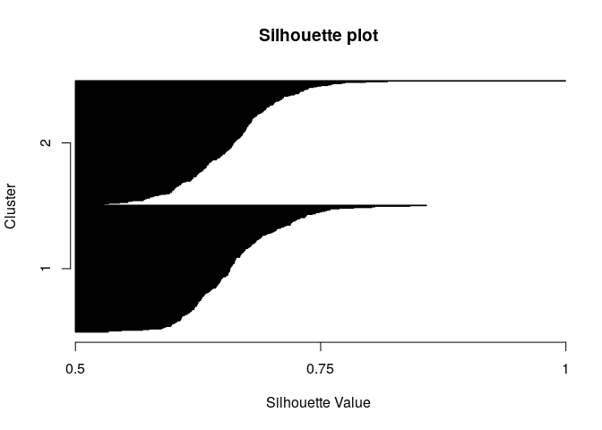

Probabilistic Distance Clustering
================
2023-06-05

- <a href="#pdq-with-fpdclustering" id="toc-pdq-with-fpdclustering">PDQ
  with FPDclustering</a>

# PDQ with FPDclustering

Probabilistic distance clustering (PD-clustering) is an iterative,
distribution free, probabilistic clustering method. PD clustering
assigns units to a cluster according to their probability of membership,
under the constraint that the product of the probability and the
distance of each point to any cluster center is a constant.

Source:
[DataCamp](https://app.datacamp.com/workspace/preview?_tag=rdocs&rdocsPath=packages%2FFPDclustering%2Fversions%2F2.0%2Ftopics%2FPDQ&utm_source=r-docs&utm_medium=docs&utm_term=PDQ&utm_content=run_example_in_workspace)

Help: [PDQ function -
RDocumentation](https://www.rdocumentation.org/packages/FPDclustering/versions/2.0/topics/PDQ)

See also:

- [FDPclustering
  v2](https://www.rdocumentation.org/packages/FPDclustering/versions/2.0)
- [PDC function -
  RDocumentation](https://www.rdocumentation.org/packages/FPDclustering/versions/2.0/topics/PDC)

``` r
if(!require('FPDclustering')) {
  install.packages('FPDclustering')
  library('FPDclustering')
}
```

``` r
library(FPDclustering)
```

    ## Loading required package: ThreeWay

    ## Loading required package: mvtnorm

    ## Registered S3 method overwritten by 'GGally':
    ##   method from   
    ##   +.gg   ggplot2

``` r
#Mixed type data

sig=matrix(0.7,4,4)
diag(sig)=1###creat a correlation matrix
x1=rmvnorm(200,c(0,0,3,3))##  cluster 1
x2=rmvnorm(200,c(4,4,6,6),sigma=sig)##  cluster 2
x=rbind(x1,x2)# data set with 2 clusters
l=c(rep(1,200),rep(2,200))#creating the labels
x1=cbind(x1,rbinom(200,4,0.2),rbinom(200,4,0.2))#categorical variables
x2=cbind(x2,rbinom(200,4,0.7),rbinom(200,4,0.7))
x=rbind(x1,x2) ##Data set

#### Performing PDQ
pdq_class<-PDQ(x=x,k=2, ini="random", dist="gower", cont= 1:4, cat = 5:6)
```

``` r
###Output
table(l,pdq_class$label)
```

    ##    
    ## l     1   2
    ##   1 200   0
    ##   2   2 198

``` r
plot(pdq_class)
```

<!-- --><!-- --><!-- -->

    ## NULL

<!-- --><!-- -->

    ## NULL

``` r
summary(pdq_class)
```

    ##   Cluster N. of elements
    ## 1       1            202
    ## 2       2            198

``` r
###Continuous data example
# Gaussian Generated Data  no  overlap
x<-rmvnorm(100, mean=c(1,5,10), sigma=diag(1,3))
y<-rmvnorm(100, mean=c(4,8,13), sigma=diag(1,3))
data<-rbind(x,y)
```

``` r
#### Performing PDQ
pdq1=PDQ(data,2,ini="random",dist="euc")
```

``` r
table(rep(c(2,1),each=100),pdq1$label)
```

    ##    
    ##       1   2
    ##   1   0 100
    ##   2 100   0

``` r
Silh(pdq1$probability)
```

<!-- -->

    ## [1] 0.2915659

``` r
plot(pdq1)
```

<!-- --><!-- --><!-- -->

    ## NULL

``` r
summary(pdq1)
```

    ##   Cluster N. of elements
    ## 1       1            100
    ## 2       2            100

``` r
# Gaussian Generated Data with  overlap
x2<-rmvnorm(100, mean=c(1,5,10), sigma=diag(1,3))
y2<-rmvnorm(100, mean=c(2,6,11), sigma=diag(1,3))
data2<-rbind(x2,y2)
```

``` r
#### Performing PDQ
pdq2=PDQ(data2,2,ini="random",dist="euc")
```

``` r
table(rep(c(1,2),each=100),pdq2$label)
```

    ##    
    ##      1  2
    ##   1 82 18
    ##   2 30 70

``` r
plot(pdq2)
```

<!-- --><!-- --><!-- -->

    ## NULL

``` r
summary(pdq2)
```

    ##   Cluster N. of elements
    ## 1       1            112
    ## 2       2             88
