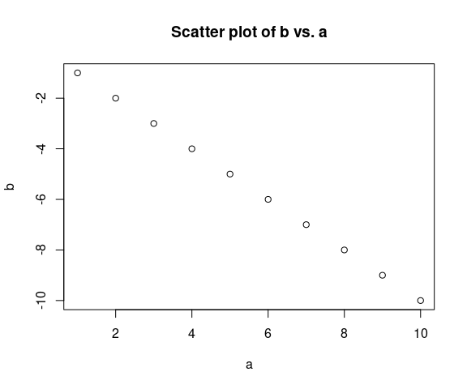
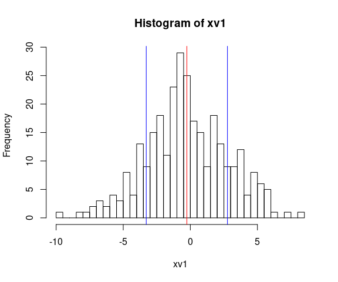
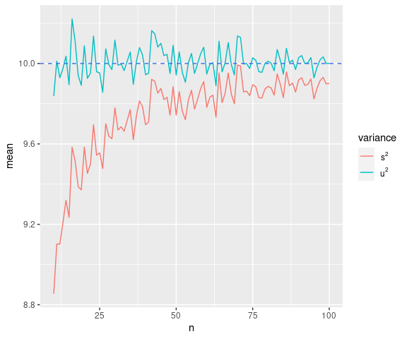
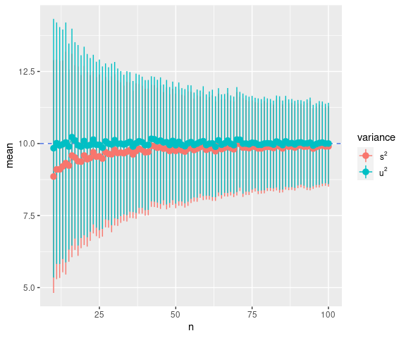

Literate Programming with R Markdown
================
Yuki Yanai (original document)Marco Malva (minor modifications)

- <a href="#introduction" id="toc-introduction">Introduction</a>
  - <a href="#how-use-this-document" id="toc-how-use-this-document">How Use
    This Document</a>
  - <a href="#goal" id="toc-goal">Goal</a>
  - <a href="#audience" id="toc-audience">Audience</a>
  - <a href="#what-is-r-markdown" id="toc-what-is-r-markdown">What is R
    Markdown</a>
  - <a href="#alternatives" id="toc-alternatives">Alternatives</a>
  - <a href="#credits" id="toc-credits">Credits</a>
  - <a href="#changelog" id="toc-changelog">Changelog</a>
- <a href="#markdown-basics" id="toc-markdown-basics">Markdown Basics</a>
  - <a href="#italic-and-bold-fonts" id="toc-italic-and-bold-fonts">Italic
    and Bold Fonts</a>
  - <a href="#bullet-points" id="toc-bullet-points">Bullet Points</a>
  - <a href="#numberd-lists" id="toc-numberd-lists">Numberd Lists</a>
  - <a href="#local-and-remote-links" id="toc-local-and-remote-links">Local
    and Remote Links</a>
  - <a href="#mathematical-formulae"
    id="toc-mathematical-formulae">Mathematical Formulae</a>
  - <a href="#r-code-chunks" id="toc-r-code-chunks">R Code Chunks</a>
  - <a href="#quoting-r-variable-values-in-text"
    id="toc-quoting-r-variable-values-in-text">Quoting R Variable Values in
    Text</a>
  - <a href="#add-plot-charts" id="toc-add-plot-charts">Add Plot Charts</a>
  - <a href="#add-charts" id="toc-add-charts">Add Charts</a>
  - <a href="#deferring-output" id="toc-deferring-output">Deferring
    Output</a>
  - <a href="#draw-normal-distributed-sample"
    id="toc-draw-normal-distributed-sample">Draw Normal Distributed
    Sample</a>
  - <a href="#supported-languages" id="toc-supported-languages">Supported
    Languages</a>
  - <a href="#output-targets" id="toc-output-targets">Output Targets</a>
    - <a href="#github_document" id="toc-github_document">github_document</a>
  - <a href="#getting-help" id="toc-getting-help">Getting Help</a>
- <a href="#example-simulations-in-r"
  id="toc-example-simulations-in-r">Example: Simulations in R</a>
  - <a href="#variances-and-unbiased-variances"
    id="toc-variances-and-unbiased-variances">Variances and Unbiased
    Variances</a>
  - <a href="#setting-up-the-simulations"
    id="toc-setting-up-the-simulations">Setting Up the Simulations</a>
  - <a href="#write-functions-to-run-simulations"
    id="toc-write-functions-to-run-simulations">Write Functions to Run
    Simulations</a>
- <a href="#appendix" id="toc-appendix">Appendix</a>
  - <a href="#session-info" id="toc-session-info">Session Info</a>

<br>

# Introduction

## How Use This Document

You should open this Rmd file with RStudio but any text editor will do.

In order to generate and view it as a HTML file click on the Knit icon
 in RStudio.

If you are not familiar with RStudio you might want to quickly read [R
Markdown Quick
Tour](https://rmarkdown.rstudio.com/authoring_quick_tour.html)

The current, work-in-progress version of this R Markdown file is
available [Literate-Programming.Rmd \| Github
develop](https://github.com/marcomalva/rstudio-rmarkdown-primer/blob/develop/topic/distribution-shape/Literate-Programming.Rmd).

## Goal

The goal of this document is to give

1.  A brief overview of Markdown
2.  A brief overview of R Markdown and literate programming
3.  Discuss the biased and non biased estimator for sample variance
4.  Show the bias on a single sample
5.  Show the convergence of biased and non biased estimator with
    increased sample size using R simulation

## Audience

The document is best suited to those who

- already have some basic statistical knowledge and
- have used RStudio at least once or twice already

For those who do not know about RStudio or R it can serve as an
illustration as what is possible and how easy it is to get started.

## What is R Markdown

R Markdown is Markdown combined with R using the `knitr` package. It was
originally generated by [Yihui Xhi](https://yihui.org/), at that time a
PhD student at the Iowa State University. There is the
[presentation](https://slides.yihui.org/2020-covid-rmarkdown.html#1)
about it.

R Markdown is a variation of **literate programming** where the author
combines normal text with programming instructions such that when run
through a program the output combines the normal text with the
programming instructions.

This allows to share and reproduce data research in an easy to read way
while adding the processing capabilities of the computer programs. It
also allows to run the combine the same text with different data sets
for repetitive tasks or evolving data set.

As it does not use a special file format you can open and edit the file
with any text editor. However, it is best if you use a dedicated editor
such as RStudio.

The text files can also be nicely version controlled by a version
control system such as `git`. This way one can capture ow the text and
the compute instructions change over time.

One can find a **few hundreds “published” books written in R Markdown**
on [Bookdown \| Home](https://bookdown.org/). Many of which are
published but available for free online, for example:

- [R Markdown: The Definitive Guide \| Yihui Xie, J. J. Allaire, Garrett
  Grolemund](https://bookdown.org/yihui/rmarkdown/)
- [R Markdown Cookbook \| Yihui Xie, Christophe Dervieux, Emily
  Riederer](https://bookdown.org/yihui/rmarkdown-cookbook/)
- [R Graphics Cookbook, 2nd edition \| Winston
  Chang](https://r-graphics.org/)

About a **million R Markdown reports** are published to
[RPubs](https://rpubs.com/). You can publish your own documents with one
click to the publish icon .
All you need is a free account with RPubs.

A couple of these published reports:

- [RPubs - How to publish paper(s)
  online?](https://rpubs.com/cathydatascience/518692)
- [RPubs - Solving Integrals - DATA 605
  HW13](https://rpubs.com/melbow2424/1035808)

One downside is that there source file, that is the R Markdown, is not
published alongside the HTML document on RPubs. This means, that the
author must either be so kind to provide a link to the R Markdown file
hosted in some other place, like for example Github, or one must a
little trick to embed the R Markdown file as a download link inside the
published HTML file: [RPubs - Including Rmd Source in
RPubs](https://rpubs.com/ramnathv/including_rmd_source).

If you are interested in publishing articles from R Markdown have a look
at: [Distill for R Markdown: Publishing
Articles](https://rstudio.github.io/distill/publish_article.html).

There is a web site for R in Journalism: [Getting started :: Journalism
with R](https://learn.r-journalism.com/en/introduction/).

## Alternatives

Another, popular open source alternative to R Markdown is [Jupyter
Notebook \| Project Jupyter Home](https://jupyter.org/).

## Credits

This is a slightly modified R Markdown document originally written by
Yuki Yanai.

- The original R Markdown [Yuki Yanai’s R
  Markdown](http://yukiyanai.github.io/teaching/rm1/contents/R/Literate-Programming.Rmd).
- The original HTML file [Literate Programming \| Yuki
  Yanai](http://yukiyanai.github.io/teaching/rm1/contents/R/Literate-Programming.html)

The modifications were focused on making the document more useful to a
reader who is new to RStudio and R Markdown. The R code blocks were not
modified other than what was necessary to avoid `knit` errors. All other
changes are about providing more context and additional resources to the
reader, remove unnecessary details, and give a brief introduction into
drawing a normal distributed sample.

1.  Make `source("~/.Rprofile")` conditional on existence of the file
    `~/.Rprofile` as otherwise it won’t knit if you do not have that
    file
2.  Remove the comments on Yuki Yanai’s CSS file as it is not needed to
    get started
3.  Remove the comments about generating the HTML file as clicking Knit
    in RStudio is more adequate for a beginner
4.  Add more context about the goals of this document
5.  Add more context on the benefits and goals of Markdown and R
    Markdown
6.  Add sections and subsections to get a useful TOC
7.  Use the YAML header to specify the output and at a TOC
8.  Add links to useful resources for picking the right graph type for
    your data or to find inspiration
9.  Add links to useful resources for creating a large variety of chart
    types
10. Add information about published reports and books
11. Add section about drawing normal distributed values
12. Add plot of drawn sample with vertical lines for mean +/- standard
    deviation
13. Add section about adding charts as/from code blocks 1 Add section
    that lists which libraries were used, a good practice for
    reproducible documents
14. Add note on help function
15. Add links to published books

## Changelog

Changes applied after and in addition to the changes from the original
documents listed in the section [Credits](#Credits):

1.  Add Changelog section
2.  Add `github_document` to `output` as target in YAML so we get a
    markdown file that renders nicely on Github
3.  Add Output Targets section and sub section on `github_document`
    output.

# Markdown Basics

In Markdown and R Markdown you can simply write your sentences as usual.

## Italic and Bold Fonts

You can make some words italic like *this is italic* or *this is also
italic*. You can also use the bold font like **this** or **this**. The
bold italic can be used like ***this*** or ***this***.

To begin a new line, insert a line between sentences.

## Bullet Points

You can create bullet points as follows.

- Item 1
- Item 2
  - Item 2-1
  - Item 2-2

Alternatively,

- Item 1
  - Item 1-1
  - Item 1-2
- Item 2

A single space is necessary after \* or -. To make nested lists, indent
blocks by tab.

## Numberd Lists

Numbered lists can be created as follows.

1.  First item
2.  Second item
    1.  What?
    2.  How?
3.  Third item

Note that the numbers you entere only indicate that the list is
numbered. The odered numbers are automatically assigned in the output,
so you don’t have to worry about the numbering. It might be a good
practice to use only “1” for numbered lists in order to make re-ordering
easy.

## Local and Remote Links

You can paste a link like this: [Yuki Yanai’s
Website](http://yukiyanai.com/).

You can insert a local image in the page: 

You can also show remote images with their URL: 

> I used `pngquant` to compress the PNG image down to `11 KB` from
> `32 KB`.

## Mathematical Formulae

You can write math formulae as you do in LaTeX. To write an inline
formula, type LaTeX style formula between `$`s. E.g.,

To write formulae in an independent block, type LaTeX style formulae
between `$$`s. E.g.,

^2}{n}.")

\# R Markdown Introduction

R Markdown is Markdown plus the ability to have R code chunks that can
be evaluated by R and do statistical computation.

## R Code Chunks

In R Markdown files, you write R codes in blocks called *code chunks*. A
simple code chunk is like this:

``` r
a <- 1:10
b <- -1:-10
```

As this example shows, the code chunk starts and ends with three
backquotes (\`\`\`) (Note that the end mark must be three backquotes
too, not three quotes). After the first three backquotes, write {r} to
tell the program that it is a chunk for R codes.After “r” and a space,
you should write the name of a chunk. You have to give a unique name to
each chunk.

In RStudio you can also insert code chunks through the menu
`Code | Insert Chunk` or the hot key combination `Alt - Ctrl -I`.

## Quoting R Variable Values in Text

To insert an R code (without the output) in a sentence, write, for
instance, “you can obtain the mean of x by `mean(x)`”.

To show the outcome (evaluated value) in a sentence, insert “r” before
the command: “the mean of

is 5.5”. The variable `a` is a vector with numbers from 1 to 10, i.e. 1,
2, 3, 4, 5, 6, 7, 8, 9, 10.

> This is a key point of **literate programming** as it allows to insert
> computed values in to the text while also having the compute
> instructions within the same document so it is a single, cohesive
> source.

## Add Plot Charts

You can include figures and tables in R Markdown files.

``` r
plot(a, b, main = "Scatter plot of b vs. a")
```

<!-- -->

Many more plots are presented in the 1[R-Graph
Gallery](https://r-graph-gallery.com/index.html). It displays about 400
charts, alongside reproducible code and explanations. The charts are
organized by family and types.

If you are looking for an inspiration check out the [Dataviz Inspiration
Site](https://www.dataviz-inspiration.com/). It showcases 159 of the
most beautiful and impactful dataviz projects.

If you are looking for a guide to pick the best graph type your data
give [Data-To-Viz](https://www.data-to-viz.com/) a try. It leads you to
the most appropriate graph for your data. It links to the code to build
it and lists common caveats you should avoid. The “Acknowledgements in
the [Data-To-Viz \| About
Section](https://www.data-to-viz.com/about.html) are listed many good
resources to improve your R Markdown skills. These cover”story telling
side” as well as technical aspects.

## Add Charts

There are additional plugin available to add the ability to generate a
variety of charts from code blocks. This is a larger subject and
deferred to another document for a more in depth discussion.

For now just a few web links to get you started if you want to dive into
it:

- [Diagrams in Rmarkdown Documents \| DiagrammeR
  Package](https://rstudio-pubs-static.s3.amazonaws.com/194240_c9bc85a7f24b41a2b1f42724c525a109.html#1)
- [RStudio v0.99 Preview: Graphviz and DiagrammeR -
  Posit](https://posit.co/blog/rstudio-v0-99-preview-graphviz-and-diagrammer/)
- [Graphviz and mermaid in DiagrammeR •
  DiagrammeR](https://rich-iannone.github.io/DiagrammeR/articles/graphviz-mermaid.html)
- [Graph/Network Visualization •
  DiagrammeR](https://rich-iannone.github.io/DiagrammeR/)
- [DiagrammeR/mermaid flowchart in a Rmarkdown
  file](https://stackoverflow.com/questions/40803017/how-to-include-diagrammer-mermaid-flowchart-in-a-rmarkdown-file)
- [Gantt diagrams \| Mermaid](https://mermaid.js.org/syntax/gantt.html)
- [Kroki!](https://kroki.io/)
- [nice-move/remark-kroki: Kroki plugin of
  remark](https://github.com/nice-move/remark-kroki)
- [Use of \`plantuml\` with knitr •
  plantuml](https://rkrug.github.io/plantuml/articles/use_with_knitr.html)

These cover some of them most well known programs to generate charts
from text:

- Graphviz
- Mermaid
- Kroki
- PlantUml

## Deferring Output

By default, R evaluates the chunk at the first line(s), print the
outcome of the line(s), and then moves to the next line. E.g.,

``` r
sd(a)
```

    ## [1] 3.02765

``` r
var(a)
```

    ## [1] 9.166667

As you can see, the result of `sd(a)` is printed before `var(a)` is
evaluated.

To show results of the chunk together, set a chunk option **results** to
‘hold’. Chunk options are specified after the chunk names and a comma.

``` r
sd(a)
var(a)
```

    ## [1] 3.02765
    ## [1] 9.166667

## Draw Normal Distributed Sample

You can for example a sample of normal distributed values of size 300
with mean 0 and variance of 10 with:

``` r
xv1 <- rnorm(n=300, mean = 0, sd = sqrt(10)) # draw n=300 normal distributed values and store them in variable xv1
```

The *sample size* is `300`, the *mean* is `-0.2594894`, and its
*standard deviation* is `3.0258825`.

Showing the drawn sample in a histogram plot with vertical lines for the
mean +/- standard deviation:

``` r
hist(xv1, breaks=60)
abline(v=mean(xv1)          , col="red")
abline(v=mean(xv1) - sd(xv1), col="blue")
abline(v=mean(xv1) + sd(xv1), col="blue")
```

<!-- -->

## Supported Languages

It is worth noting that R Markdown is **not limited to R code blocks**.
About 40 languages are supported, one can list them with
`names(knitr::knit_engines$get())`:

``` r
names(knitr::knit_engines$get())
```

    ##  [1] "awk"       "bash"      "coffee"    "gawk"      "groovy"    "haskell"  
    ##  [7] "lein"      "mysql"     "node"      "octave"    "perl"      "php"      
    ## [13] "psql"      "Rscript"   "ruby"      "sas"       "scala"     "sed"      
    ## [19] "sh"        "stata"     "zsh"       "asis"      "asy"       "block"    
    ## [25] "block2"    "bslib"     "c"         "cat"       "cc"        "comment"  
    ## [31] "css"       "ditaa"     "dot"       "embed"     "eviews"    "exec"     
    ## [37] "fortran"   "fortran95" "go"        "highlight" "js"        "julia"    
    ## [43] "python"    "R"         "Rcpp"      "sass"      "scss"      "sql"      
    ## [49] "stan"      "targets"   "tikz"      "verbatim"

## Output Targets

The output targets are defined in the YAML section at the top of the
document.

### github_document

The `.Rmd` file on Github is not nice to look at, i.e. take a glance at
it
[Literate-Programming.Rmd](https://github.com/marcomalva/rstudio-rmarkdown-primer/blob/develop/topic/distribution-shape/Literate-Programming.Rmd).

The `github_document` output generates a markdown document that renders
nicely on Github. See also:

- [Creating and Pushing a R-Markdown Document to Github (including
  graphs)](https://gist.github.com/JoshuaTPierce/b919168421b40e06481080eb53c3fb2f)
- [github_document: Convert to GitHub Flavored Markdown in rmarkdown:
  Dynamic Documents for
  R](https://rdrr.io/cran/rmarkdown/man/github_document.html)

The preview looks good. One has to add the generated files to git to be
able to push them to Github. I accomplished this from command line:

``` bash
git add topic/distribution-shape/Literate-Programming.Rmd topic/distribution-shape/Literate-Programming.md topic/distribution-shape/Literate-Programming_files/
git commit
git push
```

## Getting Help

If any of the commands is unknow you can enter `?command` e.g. `?rnorm`
to see the help page for that function.

For more information abour R Markdown, visit [R Markdown \|
RStudio](http://rmarkdown.rstudio.com/). <br>

# Example: Simulations in R

## Variances and Unbiased Variances

Suppose the population variance of a random variabe

is
.
Let

denote the sample variance of
:

^2}{n}.")

Then, the expected value of the sample variance is

 = \frac{n-1}{n} \sigma^2.")

This shows that

is *not* the unbiased estimator of
.
The unbiased estimator of

is
:

^2}{n-1}.")

It is easy to prove that
 = \sigma^2"),
but let’s verify it by simulations.

## Setting Up the Simulations

First, load the packages we will use.

``` r
library("ggplot2")
library("dplyr")
```

    ## 
    ## Attaching package: 'dplyr'

    ## The following objects are masked from 'package:stats':
    ## 
    ##     filter, lag

    ## The following objects are masked from 'package:base':
    ## 
    ##     intersect, setdiff, setequal, union

Then, let’s specify the sample size
(),
the number of trials in a simulation, and the value of the population
variance
().
In addition, let’s make a variable to save the simulation results.

``` r
n <- 10         ## sample size
trials <- 1000  ## number of samples
sigma2 <- 10    ## True Variance
# prepare vectors to save the results
s2 <- rep(NA, trials)  ## vector to save sample variance
u2 <- rep(NA, trials)  ## vector to save unbiased variance
```

Now we are ready. Let’s run a simulation. Here, we use **for loop**.

``` r
for (i in 1:trials) { ## loop for the simulation, i = 1, 2, ..., trials
    x <- rnorm(n, mean = 0, sd = sqrt(sigma2))  ## random sample from N(0, sigma^2)
    s2[i] <- sum((x - mean(x))^2) / n           ## sample variance
    u2[i] <- sum((x - mean(x))^2) / (n - 1)　   ## unbiased variance
}
rm(x)  ## remove x since we won't use it
```

Once the simulation is done, let’s examine the results.

``` r
## variance
mean(s2)  ## mean of the sample variannce
```

    ## [1] 9.12289

``` r
sd(s2)    ## sd of the sample variance
```

    ## [1] 4.292783

``` r
mean(u2)  ## mean of the unbiased variance
```

    ## [1] 10.13654

``` r
sd(u2)    ## sd of the unbiased variance
```

    ## [1] 4.769759

As this example shows,

(s2) tends to be smaller than the true (population) variance. <br>

## Write Functions to Run Simulations

Above, we wrote R codes to run a simulation. However, using the codes
above, we have to run several codes again and again to repeat
simulations. To make it easy to iterate simulations, let’s write a
function to run simulations.

``` r
sim_var <- function(n, trials, true_var) {## function to simulate unbiased variance
    ## Aarguments:
    ##    n = sample size
    ##    trials = num of iterations in a simulation
    ##    true_var = sigma^2 (population variance)
    ## Rreturn: matrix of the means and sd's of s2 and u2
    s2 <- rep(NA, trials)
    u2 <- rep(NA, trials)
    for (i in 1:trials) { ## loop for a simulation
        x <- rnorm(n, sd = sqrt(true_var))  ## random sample from N(0, true.var)
        s2[i] <- sum((x - mean(x))^2) / n   ## sample variance
        u2[i] <- sum((x - mean(x))^2) / (n - 1) ## unbiased variance
    }
    res <- matrix(c(mean(s2), mean(u2), sd(s2), sd(u2)), nrow = 2)
    row.names(res) <- c("sample var.", "unbiased var.")
    colnames(res) <- c("mean", "sd")
    return(res)
}
```

Let’s run a simulatio with this function. First, when
,
run:

``` r
sim_var(n = 5, trials = 1000, true_var = 10)
```

    ##                   mean       sd
    ## sample var.   7.994260 5.673357
    ## unbiased var. 9.992825 7.091696

We got the result.

Let’s increase the smaple size to 10,

``` r
sim_var(n = 10, trials = 1000, true_var = 10)
```

    ##                    mean       sd
    ## sample var.    9.161073 4.247809
    ## unbiased var. 10.178970 4.719788

Using the function we created above, let’s make a new function to run a
simulation for different sample sizes simultaneously. Here, we define a
function to simulate all
’s
between **n_min** and **n_max**.

``` r
sim_var2 <- function(n_min = 1, n_max, trials = 1000, true_var){
    ## Arguments:
    ##       n.min = the minimum, default to 1
    ##       n.max = the maximum, no default
    ##       trials = n. of iterations in a simulation, default to 1000
    ##       true_var = sigma^2 (the population variance)
    ## Return: A list of matrix returned by sim_var
    
    ## Print error message if the input value is wrong
    if (n_min < 1) stop(message = "n.min must be a positive integer")
    if (n_max < 1) stop(message = "n.max must be a positive integer")
    if (trials < 1) stop(message = "trials must be a positive integer")
    if (true_var < 0) stop(message = "true_var must be a positive value")
    
    ## sample sizes
    n_vec <- n_min:n_max
    ## matrix to save the result
    output <- matrix(NA, nrow = length(n_vec), ncol = 5)
    colnames(output) <- c("n", "s2_mean", "u2_mean", "s2_sd", "u2_sd")
    ## run simulation by for loop
    for (i in seq_along(n_vec)) {
        ## use the function we made before
        ## save the i-th result in the i-th row
        output[i, 1] <- n_vec[i]
        output[i, 2:5] <- as.vector(sim_var(n = n_vec[i], trials = trials, 
                                            true_var = true_var))
    }
    return(output)
}      
```

For instance, run a simulation for
,
and visualize the results.

``` r
sim1 <- sim_var2(n_min = 10, n_max = 100, trials = 1000, true_var = 10)
```

Lastly, let’s visualize the result.

``` r
## make a data frame from the matrix
df <- data.frame(n = rep(sim1[, 1], 2),
                 mean = c(sim1[, 2], sim1[, 3]),
                 sd = c(sim1[, 4], sim1[, 5]),
                 type = c(rep("biased", dim(sim1)[1]), rep("unbiased", dim(sim1)[1])))
df <- df %>%
    mutate(lb = mean - sd, ub = mean + sd)
## make a plot
res_sim1 <- ggplot(df, aes(x = n, y = mean, color = type))
res_sim1 + 
    geom_line() +
    geom_abline(intercept = 10, slope = 0, color = "royalblue", linetype = "dashed") +
    scale_color_discrete(name = "variance", labels = c(expression(s^2), expression(u^2)))
```

<!-- -->

The next figure displays the same result with error bars (mean

sd).

``` r
last_plot() + 
    geom_pointrange(aes(ymin = lb, ymax = ub))
```

<!-- -->

# Appendix

## Session Info

It is a good practice to add a session info at the end of your document.
It will increase reproducibility and costs only one line of code, see
[Pimp my RMD: a few tips for R
Markdown](https:%20//holtzy.github.io/Pimp-my-rmd/).

``` r
sessionInfo()
```

    ## R version 3.6.3 (2020-02-29)
    ## Platform: x86_64-pc-linux-gnu (64-bit)
    ## Running under: Pop!_OS 20.04 LTS
    ## 
    ## Matrix products: default
    ## BLAS:   /usr/lib/x86_64-linux-gnu/openblas-pthread/libblas.so.3
    ## LAPACK: /usr/lib/x86_64-linux-gnu/openblas-pthread/liblapack.so.3
    ## 
    ## locale:
    ##  [1] LC_CTYPE=en_US.UTF-8       LC_NUMERIC=C              
    ##  [3] LC_TIME=en_US.UTF-8        LC_COLLATE=en_US.UTF-8    
    ##  [5] LC_MONETARY=en_US.UTF-8    LC_MESSAGES=en_US.UTF-8   
    ##  [7] LC_PAPER=en_US.UTF-8       LC_NAME=C                 
    ##  [9] LC_ADDRESS=C               LC_TELEPHONE=C            
    ## [11] LC_MEASUREMENT=en_US.UTF-8 LC_IDENTIFICATION=C       
    ## 
    ## attached base packages:
    ## [1] stats     graphics  grDevices utils     datasets  methods   base     
    ## 
    ## other attached packages:
    ## [1] dplyr_1.0.9   ggplot2_3.3.3
    ## 
    ## loaded via a namespace (and not attached):
    ##  [1] pillar_1.8.0     compiler_3.6.3   highr_0.9        tools_3.6.3     
    ##  [5] digest_0.6.27    evaluate_0.15    lifecycle_1.0.3  tibble_3.1.8    
    ##  [9] gtable_0.3.0     pkgconfig_2.0.3  rlang_1.1.0      cli_3.6.1       
    ## [13] DBI_1.1.1        rstudioapi_0.13  yaml_2.2.1       xfun_0.38       
    ## [17] fastmap_1.1.0    withr_2.4.2      knitr_1.42       generics_0.1.3  
    ## [21] vctrs_0.4.1      grid_3.6.3       tidyselect_1.1.2 glue_1.6.2      
    ## [25] R6_2.5.1         fansi_1.0.3      rmarkdown_2.14   purrr_0.3.4     
    ## [29] farver_2.1.0     magrittr_2.0.3   scales_1.1.1     htmltools_0.5.3 
    ## [33] assertthat_0.2.1 colorspace_2.0-1 labeling_0.4.2   utf8_1.2.2      
    ## [37] munsell_0.5.0
