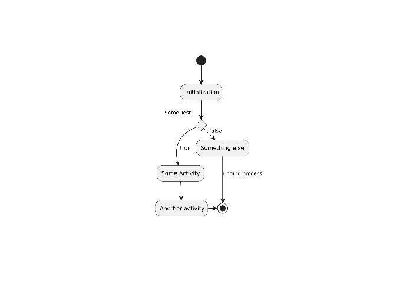
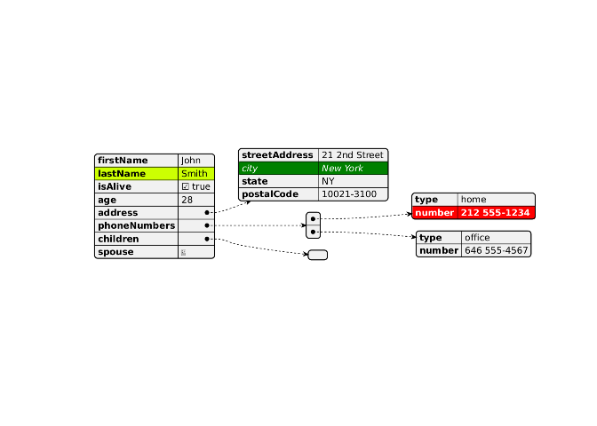
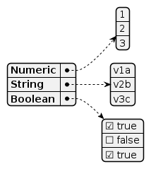
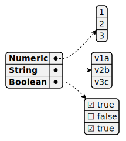
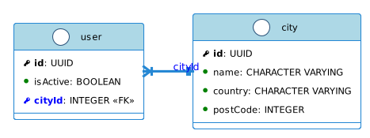
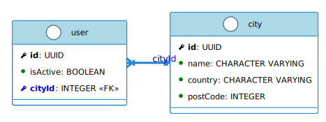

Use PlantUML
================
Marco Malva
2023-12-21

- <a href="#use-plantuml-with-rmarkdown"
  id="toc-use-plantuml-with-rmarkdown">Use PlantUML with RMarkdown</a>
  - <a href="#setup-plantuml" id="toc-setup-plantuml">Setup PlantUML</a>
    - <a href="#install-system-packages"
      id="toc-install-system-packages">Install System Packages</a>
    - <a href="#install-r-packages" id="toc-install-r-packages">Install R
      Packages</a>
    - <a href="#load-libraries" id="toc-load-libraries">Load Libraries</a>
  - <a href="#use-remote-server" id="toc-use-remote-server">Use Remote
    Server</a>
    - <a href="#test-plantuml---remote" id="toc-test-plantuml---remote">Test
      PlantUML - Remote</a>
    - <a href="#test-json---remote" id="toc-test-json---remote">Test JSON -
      Remote</a>
    - <a href="#test-json-from-file" id="toc-test-json-from-file">Test JSON
      From File</a>
  - <a href="#use-local-plantuml-server"
    id="toc-use-local-plantuml-server">Use Local PlantUML Server</a>
  - <a href="#standalone-plantuml-server"
    id="toc-standalone-plantuml-server">Standalone PlantUML Server</a>
    - <a href="#docker-container" id="toc-docker-container">Docker
      Container</a>
    - <a href="#packaged-plantuml-server"
      id="toc-packaged-plantuml-server">Packaged PlantUML Server</a>
    - <a href="#generate-from-cli" id="toc-generate-from-cli">Generate From
      CLI</a>
  - <a href="#diagram-options" id="toc-diagram-options">Diagram Options</a>
    - <a href="#uml-class-diagram" id="toc-uml-class-diagram">UML Class
      Diagram</a>
    - <a href="#customize-output" id="toc-customize-output">Customize
      Output</a>
  - <a href="#related-software" id="toc-related-software">Related
    Software</a>
    - <a href="#json2puml" id="toc-json2puml">json2puml</a>
    - <a href="#terraform-plantuml"
      id="toc-terraform-plantuml">terraform-plantuml</a>
  - <a href="#plantuml-alternatives" id="toc-plantuml-alternatives">PlantUML
    Alternatives</a>
    - <a href="#ggdag" id="toc-ggdag">GGDag</a>
    - <a href="#dagitty" id="toc-dagitty">dagitty</a>
    - <a href="#nomnoml" id="toc-nomnoml">nomnoml</a>
    - <a href="#diagram" id="toc-diagram">diagram</a>
    - <a href="#digrammer" id="toc-digrammer">digrammeR</a>
    - <a href="#r2d3" id="toc-r2d3">r2d3</a>
    - <a href="#igraph" id="toc-igraph">igraph</a>
  - <a href="#appendix" id="toc-appendix">Appendix</a>
    - <a href="#a---session-info" id="toc-a---session-info">A - Session
      Info</a>
    - <a href="#b---links" id="toc-b---links">B - Links</a>
    - <a href="#c--plantuml-runtime-note" id="toc-c--plantuml-runtime-note">C-
      PlantUML Runtime Note</a>
    - <a href="#d---debug-planuml" id="toc-d---debug-planuml">D - Debug
      PlanUML</a>

# Use PlantUML with RMarkdown

This documents described how I got [PlantUML for
R](https://github.com/rkrug/plantuml) to work with my `podman` RStudio
container. It can also serve as a Hello World” project when starting to
work with PlantUML from RMarkdown as if this document knits then the
setup is working.

My main interest was to find a solution to documenting JSON documents,
JSON document structures, database tables and relationships.
[PlantUML](https://plantuml.com) appears to be a good fit because it:

- supports a wide variety of diagram types (UML, JSON, …)
- integrates with many other software applications
  [plantuml.com/running](https://plantuml.com/running)
- can be embedded into RMarkdown document but run also standalone
- has a relative simple syntax for defining structures
- allows to keep the structures defined in external files (`*.puml` or
  `*.plantuml`)
- can generate visually pleasing figures in PNG, SVG, and other formats
- supports a public playground
- supports a local, private playground via a `docker` image

What makes RMarkdown interesting is the ability to combine the diagram
capabilities of PlantUML with record processing/summary which allows to
generate tenant specific examples. That pushes the solution beyond
simply document the document structure to analyzing a live database with
record metrics.

As for placing a **blue frame around some of the figures**, that idea
was obtained in [Tips and tricks for working with images and figures in
R Markdown documents \| Technical Tidbits From Spatial Analysis & Data
Science](http://zevross.com/blog/2017/06/19/tips-and-tricks-for-working-with-images-and-figures-in-r-markdown-documents/).
That article also explains how to use an external CSS file for that
purpose which would be the proper way to it. It also explains how to
generated space optimized (smaller) PNG figures with `optipng` and
`pngquant`.

I switched to `output: bookdown::html_document2:` from
`output: html_document` as that has automatic numbering for figures, if
the figures have a caption - as they should. A couple of links with more
material about bookdown:

- [4.10 Numbered figure captions \| R Markdown
  Cookbook](https://bookdown.org/yihui/rmarkdown-cookbook/figure-number.html)
- [2.4 Figures \| bookdown: Authoring Books and Technical Documents with
  R Markdown](https://bookdown.org/yihui/bookdown/figures.html)
- [9 Figures, Tables, Captions. \| RMarkdown for
  Scientists](https://rmd4sci.njtierney.com/figures-tables-captions-)
- [2.2 Markdown extensions by bookdown \| bookdown: Authoring Books and
  Technical Documents with R
  Markdown](https://bookdown.org/yihui/bookdown/markdown-extensions-by-bookdown.html#equations)

As for **working with JSON** from R/RStudio:

- [GitHub - colearendt/tidyjson: Tidy your JSON data in R with
  tidyjson](https://github.com/colearendt/tidyjson)
- [GitHub - timelyportfolio/listviewer: R htmlwidget to view
  lists](https://github.com/timelyportfolio/listviewer)
  - [GitHub - josdejong/jsoneditor: A web-based tool to view, edit,
    format, and validate JSON](https://github.com/josdejong/jsoneditor)
  - [GitHub - josdejong/svelte-jsoneditor: A web-based tool to view,
    edit, format, repair, query, transform, and validate
    JSON](https://github.com/josdejong/svelte-jsoneditor)
  - [GitHub - microlinkhq/react-json-view: JSON viewer for
    react](https://github.com/microlinkhq/react-json-view)
- [prettify: Prettify or minify a JSON string in
  R](https://rdrr.io/cran/jsonlite/man/prettify.html)

## Setup PlantUML

### Install System Packages

The launch script is
[./scripts/docker-run-rstudio-mounted-volumes.sh](https://github.com/marcomalva/rstudio-rmarkdown-primer/blob/develop/scripts/docker-run-rstudio-mounted-volumes.sh)

I connected to my `docker` container with `podman exec` and installed
the missing system packages with `apt install`:

``` bash
apt install librsvg2-bin
apt install librsvg2-dev

# so I can use curl in RStudio | Terminal
apt install curl

# plantuml is a JAR and uses graphviz/dot
apt install default-jre
apt install graphviz
```

The installed versions are:

``` bash
# Linux distribution
root@2d8d4b74a935:/dev/shm# cat /etc/lsb-release
DISTRIB_ID=Ubuntu
DISTRIB_RELEASE=22.04

# java version
root@2d8d4b74a935:/dev/shm# java -version
openjdk version "11.0.21" 2023-10-17
OpenJDK Runtime Environment (build 11.0.21+9-post-Ubuntu-0ubuntu122.04)
OpenJDK 64-Bit Server VM (build 11.0.21+9-post-Ubuntu-0ubuntu122.04, mixed mode, sharing)

# dot version
root@2d8d4b74a935:/dev/shm# dot -V
dot - graphviz version 2.43.0 (0)
```

### Install R Packages

Following the instructions:

``` r
options(repos = c(rkrug = 'https://rkrug.r-universe.dev', CRAN = 'https://cloud.r-project.org'))

# Download and install plantuml in R
install.packages('plantuml')

# Browse the plantuml manual pages
help(package = 'plantuml')
```

### Load Libraries

``` r
library(plantuml)
```

    ## The package is by default using the online plantuml server
    ## at http://www.plantuml.com/plantuml/
    ## If you want to use a different server or the local plantuml server,
    ## please set the addresss and the port by e.g.
    ## 
    ##    plantumlOptions(server_url = 'http://localhost/')
    ##    plantumlOptions(server_port = '8080')
    ## 
    ## If you are using the local plantuml server, you have to start it by
    ## 
    ##    server_set("local")
    ##    server_start()
    ## 
    ## and stop it t the end using
    ## 
    ##    stop_server()   server_set("local")

``` r
# print details on PlantUML Configuration, see https://github.com/rkrug/plantuml/blob/master/R/plantuml_run.R#L31-L38
message("PlantUML Default Configuration:", "\n",
  "java_bin: ", getPlantumlOption("java_bin"), "\n",
  "java_opt: ", getPlantumlOption("java_opt"), "\n",
  "jar_name: ", getPlantumlOption("jar_name"), "\n",
  "plantuml_opt: ", getPlantumlOption("plantuml_opt"),
  "server_infot: ",plantuml::server_info()
)
```

    ## PlantUML Default Configuration:
    ## java_bin: /usr/bin/java
    ## java_opt: -Djava.awt.headless=true -splash:no
    ## jar_name: /home/rstudio/.cache/R/plantuml/jar/plantuml.jar
    ## plantuml_opt: -Playout=smetanaserver_infot: 1.2024.0beta2FALSEc("png", "svg", "txt")

## Use Remote Server

By default, the `plantuml` package uses the public PlantUML server at
<http://www.plantuml.com/plantuml/>.

``` r
# use remote server, added to reset system if chunks are played individually
plantumlOptions(server_url = NULL)
plantuml::server_set("remote")
```

PlantUML options, see [plantuml_run.R
·GitHub](https://github.com/rkrug/plantuml/blob/master/R/plantuml_run.R#L31-L38):

``` r
# print details on PlantUML Configuration, see https://github.com/rkrug/plantuml/blob/master/R/plantuml_run.R#L31-L38
message("PlantUML Default Configuration:", "\n",
  "java_bin: ", getPlantumlOption("java_bin"), "\n",
  "java_opt: ", getPlantumlOption("java_opt"), "\n",
  "jar_name: ", getPlantumlOption("jar_name"), "\n",
  "plantuml_opt: ", getPlantumlOption("plantuml_opt"),
  "server_infot: ",plantuml::server_info()
)
```

    ## PlantUML Default Configuration:
    ## java_bin: /usr/bin/java
    ## java_opt: -Djava.awt.headless=true -splash:no
    ## jar_name: /home/rstudio/.cache/R/plantuml/jar/plantuml.jar
    ## plantuml_opt: -Playout=smetanaserver_infot: 1.2024.0beta2FALSEc("png", "svg", "txt")

### Test PlantUML - Remote

Using the sample code from [R package for
plantuml](https://github.com/rkrug/plantuml#define-plantuml-code):

``` r
x1.txt <- '
(*) --> "Initialization"

if "Some Test" then
  -->[true] "Some Activity"
  --> "Another activity"
  -right-> (*)
else
  ->[false] "Something else"
  -->[Ending process] (*)
endif
'
x1.po <- plantuml(x1.txt)
```

``` r
# one can specify the file name with: file = "myplot.svg"
plot(x1.po)
```

<div class="figure">


<p class="caption">
UML State Diagram - Remote
</p>

</div>

    ## [1] "/tmp/RtmpPmCPhg/plantuml.688116f0a3cf.svg"

### Test JSON - Remote

Adapting the sample code from:
[plantuml.com/json#d8ffd91ff7cbc8d8](https://plantuml.com/json#d8ffd91ff7cbc8d8)

``` r
x2.txt <- '
@startjson
<style>
  .h1 {
    BackGroundColor green
    FontColor white
    FontStyle italic
  }
  .h2 {
    BackGroundColor red
    FontColor white
    FontStyle bold
  }
</style>
#highlight "lastName"
#highlight "address" / "city" <<h1>>
#highlight "phoneNumbers" / "0" / "number" <<h2>>
{
  "firstName": "John",
  "lastName": "Smith",
  "isAlive": true,
  "age": 28,
  "address": {
    "streetAddress": "21 2nd Street",
    "city": "New York",
    "state": "NY",
    "postalCode": "10021-3100"
  },
  "phoneNumbers": [
    {
      "type": "home",
      "number": "212 555-1234"
    },
    {
      "type": "office",
      "number": "646 555-4567"
    }
  ],
  "children": [],
  "spouse": null
}
@endjson
'
x2.po <- plantuml(x2.txt)
```

``` r
plot(x2.po)
```

<div class="figure">


<p class="caption">
JSON Document - Remote Render
</p>

</div>

    ## [1] "/tmp/RtmpPmCPhg/plantuml.6881220ac593.svg"

### Test JSON From File

Ideally, the JSON structure definition is kept in a separate file so it
is isolated and better managed in version control system. This also
allows to visualize it with a standalone PlantUML without the need for
`R` or RMarkdown.

Adapting the sample code from:
[plantuml.com/json#d8ffd91ff7cbc8d8](https://plantuml.com/json#d8ffd91ff7cbc8d8)

``` r
# reading the JSON definition from a file
fname="json_array.plantuml"
if (file.exists(fname)) {
  x3.txt <- readr::read_file(fname)
  x3.po <- plantuml(x3.txt)
}
```

``` r
# plotting it
if ( exists("x3.po")) {
  plot(x3.po)
}
```


    ## [1] "/tmp/RtmpPmCPhg/plantuml.688115cf4eef.svg"

## Use Local PlantUML Server

This section describes what to do to use a local PlantUML server. This
way one avoids sending the diagram data to a public web address.

The following code chunk configures and starts the PlantUML server
within the `docker` container:

``` r
# configure plantuml server
plantumlOptions(server_url = 'http://localhost/')
plantumlOptions(server_port = '8080')
plantumlOptions(java_bin = 'java')

## start local plantuml server
plantuml::server_set("local")
plantuml::server_start()
```

    ## $version
    ## [1] "1.2023.13"
    ## 
    ## $PicoWebServer
    ## [1] TRUE
    ## 
    ## $formats
    ## [1] "png" "svg" "txt"

The configuration for the local PlantUML server is:

``` r
# print details on PlantUML Configuration, see https://github.com/rkrug/plantuml/blob/master/R/plantuml_run.R#L31-L38
message("PlantUML Default Configuration:", "\n",
  "java_bin: ", getPlantumlOption("java_bin"), "\n",
  "java_opt: ", getPlantumlOption("java_opt"), "\n",
  "jar_name: ", getPlantumlOption("jar_name"), "\n",
  "plantuml_opt: ", getPlantumlOption("plantuml_opt"),
  "server_info: ", plantuml::server_info()
)
```

    ## PlantUML Default Configuration:
    ## java_bin: java
    ## java_opt: -Djava.awt.headless=true -splash:no
    ## jar_name: /home/rstudio/.cache/R/plantuml/jar/plantuml.jar
    ## plantuml_opt: -Playout=smetanaserver_info: 1.2023.13TRUEc("png", "svg", "txt")

Plot the state diagram with the local PlantUML server:

``` r
x1.po_local <- plantuml::plantuml(x1.txt)
plot(x1.po_local)
```


    ## [1] "/tmp/RtmpPmCPhg/plantuml.6881444b8652.svg"

Plot the JSON object with the local PlantUML server:

``` r
x2.po_local <- plantuml::plantuml(x2.txt)
plot(x2.po_local)
```


    ## [1] "/tmp/RtmpPmCPhg/plantuml.6881509229e2.svg"

Stop the local PlantUML server:

``` r
# stop local plantuml server
plantuml::server_stop()
```

    ## [1] 0

## Standalone PlantUML Server

There are various ways to generate the figure files with a stand-alone
PlantUML server:

- Use REST/HTTP interface w/ a `docker/podman` container
- Use REST/HTTP interface of the bundled PlantUML server
- Use `java` command line to generate figure file(s)

This is important if one wants to generate the figures outside of
RMarkdown.

### Docker Container

One can launch a standalone PlantUML server as `docker/podman` container
with:

``` bash
# pull the docker image
podman pull plantuml/plantuml-server:jetty

# launch the docker container
podman run -d -p 8080:8080 plantuml/plantuml-server:jetty
```

Once can access this local web server with <http://localhost:8080/>.
This gives one a **local PlantUML playground**.

The version that was installed is:

> PlantUML version 1.2023.13 (Mon Dec 11 18:20:57 UTC 2023)

This server can be used to create PNG, SVG, etc. image files as follows:

``` bash
curl -X POST http://localhost:8080/png --data-binary @- -o test.png << EOF
@startjson
{
"Numeric": [1, 2, 3],
"String ": ["v1a", "v2b", "v3c"],
"Boolean": [true, false, true]
}
@endjson
EOF
```

For example, using it to plot the
[json_array.plantuml](./json_array.plantuml) into a PNG file:

``` bash
curl -X POST http://localhost:8080/png --data-binary @json_array.plantuml -o json_array.png
```

And into a SVG file:

``` bash
curl -X POST http://localhost:8080/svg --data-binary @json_array.plantuml -o json_array.svg
```

|                 png                 |                 svg                 |
|:-----------------------------------:|:-----------------------------------:|
|  |  |

### Packaged PlantUML Server

The R package launches the PlantUML server as follows:

``` bash
java -Djava.awt.headless=true -splash:no -jar /home/rstudio/.cache/R/plantuml/jar/plantuml.jar -p -t -picowebstop:8080:localhost
```

This server support GET calls with an encoded URL, refer to [The servlet
for server side](https://plantuml.com/server) and [Text Encoding
format](https://plantuml.com/text-encoding)

One can generate the encoded URL from the command line with:

``` bash
java -Djava.awt.headless=true -jar /home/rstudio/.cache/R/plantuml/jar/plantuml.jar -encodeurl json_array.plantuml
```

The command above writes to stdout:
`SoWkIImgoIhEp-EgvbBoAyrDBSfCLh9IY3RKKJ3IKJ2ErU5I2YufoinBLm29AfKP9YhfA2YL6IM1AUDa9P0Af_pydDJ4F92AagBIL1s5jCISOY05uiHorN8vfEQbWEm00000`

One can use that server with an encoded URL as follows:

``` bash
curl --output json_array_cli.png http://localhost:8080/png/SoWkIImgoIhEp-EgvbBoAyrDBSfCLh9IY3RKKJ3IKJ2ErU5I2YufoinBLm29AfKP9YhfA2YL6IM1AUDa9P0Af_pydDJ4F92AagBIL1s5jCISOY05uiHorN8vfEQbWEm00000
```

The generated figure: 

If one wants to add a figure caption, one must use
`knitr::include_graphics(...)`:

``` r

```

<div class="figure" style="text-align: center">


<p class="caption">
JSON Array CLI Generated
</p>

</div>

The Github project for the PlantUML server: [GitHub -
plantuml/plantuml-server: PlantUML Online
Server](https://github.com/plantuml/plantuml-server)

### Generate From CLI

One can generate the figure from the command line interface (CLI) with:

``` bash
java -Djava.awt.headless=true -splash:no -jar /home/rstudio/.cache/R/plantuml/jar/plantuml.jar -tsvg json_array.plantuml
```

> If one wants to use a different output directory, use the command flag
> `-output <folder_name>` to specific it.

For more information refer to: [call it from your script using command
line](https://plantuml.com/command-line)

## Diagram Options

### UML Class Diagram

One can also draw UML class diagrams. An example is in file
[user_city.puml](./user_city.puml). This is a little bit a more advanced
example, in that a theme is used and some color are set explicitly to
make render the image more visually appealing.

The command line to generate the image files is the same:

``` bash
java -Djava.awt.headless=true -splash:no -jar /home/rstudio/.cache/R/plantuml/jar/plantuml.jar -tpng user_city.puml
java -Djava.awt.headless=true -splash:no -jar /home/rstudio/.cache/R/plantuml/jar/plantuml.jar -tsvg user_city.puml
```

|                png                |                svg                |
|:---------------------------------:|:---------------------------------:|
|  |  |

``` r
# let's see if we get a caption even w/o any plot - the output is the table above
# Nope, that does not work, seems like one must use knitr::include_graphics(...)
```

As that does not work let’s try `par(...)` and `fig.show="hold"`:

``` r
tmp <- par(mar = c(4, 4, .1, .1))


par(tmp)
```

<div class="figure" style="text-align: left">


<p class="caption">
UserCity PNG (left) vs SVG (right)
</p>

</div>

This idea was taken from the “R Markdown Cookbook”, see:

- [9.4 Multiple figures side by side \| R Markdown
  Cookbook](https://bookdown.org/yihui/rmarkdown-cookbook/figures-side.html)
- [rmarkdown-cookbook/09-multiformat.Rmd at master ·
  rstudio/rmarkdown-cookbook ·
  GitHub](https://github.com/rstudio/rmarkdown-cookbook/blob/master/09-multiformat.Rmd)

The content of the `user_city.puml` file:

``` r
cat(readLines('user_city.puml'), sep = '\n')
```

    @startuml
    !theme sandstone

    left to right direction
    skinparam roundcorner 5
    skinparam linetype ortho
    skinparam shadowing false
    skinparam handwritten false
    skinparam class {
        BackgroundColor white
        HeaderBackgroundColor lightblue
        AttributeFontColor black
        ArrowColor #2688d4
        BorderColor #2688d4
    }

    !define primary_key(x) <b><color:black><&key> x</color></b>
    !define foreign_key(x) <b><color:blue><&key> x</color></b>
    !define column(x) <color:green><&media-record></color> x
    !define table(x) entity x << (T, white) >>

    table( user ) {
      primary_key( id ): UUID 
      column( isActive ): BOOLEAN 
      foreign_key( cityId ): INTEGER <<FK>>
    }

    table( city ) {
      primary_key( id ): UUID 
      column( name ): CHARACTER VARYING 
      column( country ): CHARACTER VARYING
      column( postCode ): INTEGER
    }

    user }|--|| city  : <color:blue>cityId</color>
    @enduml

This sections was inspired by [SQL + PlantUML: Generate Automatic
Database Diagrams \| by Raphaël Léger \|
Medium](https://raphael-leger.medium.com/automatically-generating-up-to-date-database-diagrams-with-typeorm-d1279a20545e).

### Customize Output

As for setting the color, refer to:

- [plantuml.com/running](https://plantuml.com/running)
- [HTML Color Names](https://www.w3schools.com/colors/colors_names.asp)
- [PlantUML Web
  Server](https://www.plantuml.com/plantuml/uml/SoWkIImgAStDuIhEpimhI2nAp4qjIIqgLk1oICrB0Oa30000)

As for themes see:

- [Puml Themes](https://bschwarz.github.io/puml-themes/gallery.html)
- [Welcome to PlantUML themes Gallery \|
  puml-themes-gallery](https://the-lum.github.io/puml-themes-gallery/)
- [plantuml/themes at master · plantuml/plantuml ·
  GitHub](https://github.com/plantuml/plantuml/tree/master/themes)

## Related Software

### json2puml

The [GitHub - jfudickar/json2puml: Generate PlantUML files based on JSON
files.](https://github.com/jfudickar/json2puml) might be useful go
generate a first cut of JSON UML files for PlantUML.

> I tried `json2puml` and found its configuration too complex for my use
> case. There might be some pointers to learn on how to color/style the
> output.

### terraform-plantuml

Generate PlantUML Images from a Terraform State file.

- [GitHub - fmalk/terraform-plantuml: Generate PlantUML Images from a
  Terraform State file](https://github.com/fmalk/terraform-plantuml)

## PlantUML Alternatives

Alternative diagram packages to PlantUML for `R` are mentioned here:

- [4.15 Create diagrams \| R Markdown
  Cookbook](https://bookdown.org/yihui/rmarkdown-cookbook/diagrams.html#diagrams)
- [Distill for R Markdown:
  Diagrams](https://rstudio.github.io/distill/diagrams.html)

Links to these alternatives are provided below

### GGDag

- [CRAN - Package
  ggdag](https://cran.r-project.org/web/packages/ggdag/index.html)
- [Analyze and Create Elegant Directed Acyclic Graphs •
  ggdag](https://r-causal.github.io/ggdag//)
- [GitHub - r-causal/ggdag: causal directed acyclic graphs
  (DAGs)](https://github.com/r-causal/ggdag)

### dagitty

- [dagitty: Graphical Analysis of Structural Causal
  Models](https://cran.r-project.org/web/packages/dagitty/dagitty.pdf)
- [GitHub - jtextor/dagitty: Graphical analysis of structural causal
  models](https://github.com/jtextor/dagitty)
- [DAGitty - drawing and analyzing causal diagrams
  (DAGs)](https://dagitty.net/)
- [Learn more about DAGs and
  DAGitty](https://dagitty.net/learn/index.html)
- [DAGitty v3.1](https://dagitty.net/dags.html)

### nomnoml

- [nomnoml: Sassy ‘UML’
  Diagrams](https://cran.r-project.org/web/packages/nomnoml/nomnoml.pdf)
- [Sassy UML Diagrams •
  nomnoml](https://rstudio.github.io/nomnoml/index.html)

### diagram

- [diagram: Visualising Simple Graphs (Networks), Plotting Flow
  Diagrams](https://cran.r-project.org/web/packages/diagram/diagram.pdf)

### digrammeR

- [Graph/Network Visualization •
  DiagrammeR](https://rich-iannone.github.io/DiagrammeR/)
- [GitHub - rich-iannone/DiagrammeR: Graph and network visualization
  using tabular data in R](https://github.com/rich-iannone/DiagrammeR/)

### r2d3

A very good source to create modern, visually very appealing charts.

- [Gallery • r2d3](https://rstudio.github.io/r2d3/articles/gallery.html)
  - [Gallery: sunburst •
    r2d3](https://rstudio.github.io/r2d3/articles/gallery/sunburst/)
  - [Gallery: treemap •
    r2d3](https://rstudio.github.io/r2d3/articles/gallery/treemap/)
  - [Gallery: bullets •
    r2d3](https://rstudio.github.io/r2d3/articles/gallery/bullets/)
- [Interface to D3 Visualizations •
  r2d3](https://rstudio.github.io/r2d3/)
- [GitHub - rstudio/r2d3: R Interface to D3
  Visualizations](https://github.com/rstudio/r2d3/)
- [Learning D3 •
  r2d3](https://rstudio.github.io/r2d3/articles/learning_d3.html)
- [Getting R and D3.js to play nicely in R markdown \| by Alice \|
  Towards Data
  Science](https://towardsdatascience.com/getting-r-and-d3-js-to-play-nicely-in-r-markdown-270e302a52d3)
  - [GitHub - becausealice2/D3-in-Rmd: How to get R and D3 to play nice
    in Rmd files](https://github.com/becausealice2/D3-in-Rmd)

### igraph

R/igraph is an R package of the igraph network analysis library:

- [Network Analysis and Visualization • igraph](https://r.igraph.org/)

## Appendix

### A - Session Info

It is a good practice to add a session info at the end of your document.
It will increase reproducibility and costs only one line of code, see
[Pimp my RMD: a few tips for R
Markdown](https://holtzy.github.io/Pimp-my-rmd/).

``` r
sessionInfo()
```

    ## R version 4.2.2 (2022-10-31)
    ## Platform: x86_64-pc-linux-gnu (64-bit)
    ## Running under: Ubuntu 22.04.2 LTS
    ## 
    ## Matrix products: default
    ## BLAS:   /usr/lib/x86_64-linux-gnu/openblas-pthread/libblas.so.3
    ## LAPACK: /usr/lib/x86_64-linux-gnu/openblas-pthread/libopenblasp-r0.3.20.so
    ## 
    ## locale:
    ##  [1] LC_CTYPE=en_US.UTF-8       LC_NUMERIC=C              
    ##  [3] LC_TIME=en_US.UTF-8        LC_COLLATE=en_US.UTF-8    
    ##  [5] LC_MONETARY=en_US.UTF-8    LC_MESSAGES=en_US.UTF-8   
    ##  [7] LC_PAPER=en_US.UTF-8       LC_NAME=C                 
    ##  [9] LC_ADDRESS=C               LC_TELEPHONE=C            
    ## [11] LC_MEASUREMENT=en_US.UTF-8 LC_IDENTIFICATION=C       
    ## 
    ## attached base packages:
    ## [1] stats     graphics  grDevices utils     datasets  methods   base     
    ## 
    ## other attached packages:
    ## [1] plantuml_0.6.9
    ## 
    ## loaded via a namespace (and not attached):
    ##  [1] rstudioapi_0.15.0 knitr_1.44        magrittr_2.0.3    hms_1.1.3        
    ##  [5] R6_2.5.1          rlang_1.1.1       fastmap_1.1.1     fansi_1.0.4      
    ##  [9] tools_4.2.2       xfun_0.40         rsvg_2.6.0        png_0.1-8        
    ## [13] utf8_1.2.3        cli_3.6.1         htmltools_0.5.6   yaml_2.3.7       
    ## [17] digest_0.6.33     tibble_3.2.1      lifecycle_1.0.3   readr_2.1.4      
    ## [21] tzdb_0.4.0        vctrs_0.6.5       glue_1.6.2        evaluate_0.21    
    ## [25] rmarkdown_2.25    compiler_4.2.2    pillar_1.9.0      jsonlite_1.8.7   
    ## [29] pkgconfig_2.0.3

### B - Links

Most but not all links in the text are repeated here. Some more links
for further reading were added as well.

- [plantuml/R/plantUML_URL.R at master · rkrug/plantuml ·
  GitHub](https://github.com/rkrug/plantuml/blob/master/R/plantUML_URL.R)

- [GitHub - plantuml/plantuml-server: PlantUML Online
  Server](https://github.com/plantuml/plantuml-server)

- [plantuml.com/json](https://plantuml.com/json)

- [plantuml.com/running](https://plantuml.com/running)

- [plantuml.com/picoweb](https://plantuml.com/picoweb)

- [The servlet for server side](https://plantuml.com/server)

- [Text Encoding format](https://plantuml.com/text-encoding)

- [call it from your script using command
  line](https://plantuml.com/command-line)

- [How to curl to plantuml-server - PlantUML
  Q&A](https://forum.plantuml.net/12504/how-to-curl-to-plantuml-server)

- [Accept plain text · Issue \#67 · plantuml/plantuml-server ·
  GitHub](https://github.com/plantuml/plantuml-server/issues/67)

- [GitHub - jfudickar/json2puml: Generate PlantUML files based on JSON
  files.](https://github.com/jfudickar/json2puml)

- [The servlet for server side](https://plantuml.com/server)

- [Text Encoding format](https://plantuml.com/text-encoding)

- [GitHub - plantuml/plantuml-server: PlantUML Online
  Server](https://github.com/plantuml/plantuml-server)

- [call it from your script using command
  line](https://plantuml.com/command-line)

- [Recommend using puml as file extension by jgarte · Pull Request
  \#171](https://github.com/skuro/plantuml-mode/pull/171)

- [SQL + PlantUML: Generate Automatic Database Diagrams \| by Raphaël
  Léger \|
  Medium](https://raphael-leger.medium.com/automatically-generating-up-to-date-database-diagrams-with-typeorm-d1279a20545e)

### C- PlantUML Runtime Note

The below is an important note if one wants to avoid sending the UML to
the online PlantUML server:

``` r
## The package is by default using the online plantuml server
## at http://www.plantuml.com/plantuml/
## If you want to use a different server or the local plantuml server,
## please set the addresss and the port by e.g.
##
##    plantumlOptions(server_url = 'http://localhost/')
##    plantumlOptions(server_port = '8080')
##
## If you are using the local plantuml server, you have to start it by
##
##    server_set("local")
##    server_start()
##
## and stop it t the end using
##
##    stop_server()   server_set("local")
```

### D - Debug PlanUML

I copied the
[plantuml_run](https://github.com/rkrug/plantuml/blob/master/R/plantuml_run.R)
and added some `message(...)` statements to figure out why the local
PlantUML originally failed. As it turned out, I had to set `java_bin`
with`plantumlOptions(java_bin = 'java')`:

``` r
plantuml_run_debug <- function(
  x = NULL,
  file = "",
  plantuml_jar = getPlantumlOption("jar_name"),
  plantuml_opt = getPlantumlOption("plantuml_opt"),
  java_bin = getPlantumlOption("java_bin"),
  java_opt = getPlantumlOption("java_opt"),
  wait = FALSE
){

  # Checks ------------------------------------------------------------------
  if (!file.exists(plantuml_jar)) {
    message(
      "##############################\n",
      "plantuml.jar file has not been downloaded.\n",
      "Trying to download it by running the command 'plantuml_update()' to download the file...\n",
      "##############################\n"
    )
    plantuml_update()
    message(
      "Done!\n",
      "##############################\n"
    )
  }

  # Run plantuml ------------------------------------------------------------

  if (!is.null(file)) {
    pos <- regexpr("\\.([[:alnum:]]+)$", file)
    type <- ifelse( pos > -1L, substring(file, pos + 1L), "")
  } else {
    stop("Invalid type for PlantUml graph!")
  }
  plantuml_opt = paste0("-p -t",type, " ", plantuml_opt)
  message("plantuml_opt =", plantuml_opt)

  cmd <- paste0(
    "-jar \"",
    plantuml_jar,
    "\""
  )
  message("cmd =", cmd)
  message("command =", java_bin)
  message("arg =", paste(java_opt, cmd, plantuml_opt))
  message("x =", x)

  result <- system2(
    command = java_bin,
    args = paste(java_opt, cmd, plantuml_opt),
    stdout = file,
    stderr = "",
    stdin = "",
    input = x,
    wait = wait
  )

  return(result)
}
```
