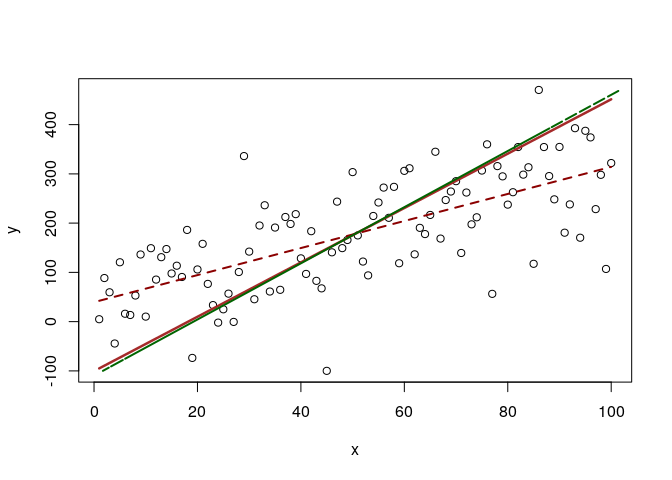
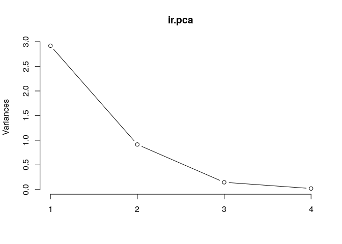
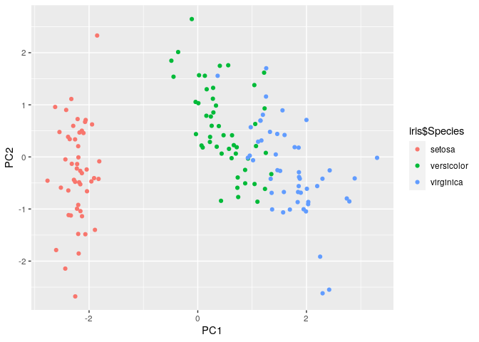

PCA Introduction
================
2023-06-05

- <a href="#execution-steps" id="toc-execution-steps">Execution Steps</a>
- <a href="#reading-material" id="toc-reading-material">Reading
  Material</a>
- <a href="#pca-example" id="toc-pca-example">PCA Example</a>
- <a href="#more-pca-links" id="toc-more-pca-links">More PCA Links</a>
- <a href="#some-source-code" id="toc-some-source-code">Some Source
  Code</a>

Principal component analysis (PCA) is a technique used to emphasize
variation and bring out strong patterns in a dataset. It’s often used to
make data easy to explore and visualize.

Principal component analysis, or PCA, is a dimensionality reduction
method that is often used to reduce the dimensionality of large data
sets, by transforming a large set of variables into a smaller one that
still contains most of the information in the large set.

Reducing the number of variables of a data set naturally comes at the
expense of accuracy, but the trick in dimensionality reduction is to
trade a little accuracy for simplicity. Because smaller data sets are
easier to explore and visualize and make analyzing data points much
easier and faster for machine learning algorithms without extraneous
variables to process.

So, to sum up, the idea of PCA is simple — **reduce the number of
variables of a data set, while preserving as much information as
possible**.

## Execution Steps

The steps to perform a PCA are:

1.  Standardize the range of continuous initial variables
2.  Compute the covariance matrix to identify correlations
3.  Compute the eigenvectors and eigenvalues of the covariance matrix to
    identify the principal components
4.  Create a feature vector to decide which principal components to keep
5.  Recast the data along the principal components axes

## Reading Material

A good visual description and real-world use case:

- <https://setosa.io/ev/principal-component-analysis/>

The original article behind the real-world use case:

- <https://web.archive.org/web/20121021022637/http://people.maths.ox.ac.uk/richardsonm/SignalProcPCA.pdf>

The initial reading material:

- [PCA
  Explained](https://builtin.com/data-science/step-step-explanation-principal-component-analysis)
- [Making Sense of PCA, eigenvectors &
  eigenvalues](https://stats.stackexchange.com/questions/2691/making-sense-of-principal-component-analysis-eigenvectors-eigenvalues)
- [YouTube Eigenvectors and eigenvalues \| Essence of Linear
  Algebra](https://www.youtube.com/watch?v=PFDu9oVAE-g)
- [PCS vs Ordinary Least Squares (OLS): A Visual
  Explanation](https://cerebralmastication.com/2010/09/principal-component-analysis-pca-vs-ordinary-least-squares-ols-a-visual-explination/)
- [PCA Example in R ·
  GitHub](https://gist.github.com/CerebralMastication/582767)
- [Drop lines from actual to modeled points in R - Stack
  Overflow](https://stackoverflow.com/questions/3737165/drop-lines-from-actual-to-modeled-points-in-r/3737183#3737183)
- [OUCS-2002-12.pdf](https://ourarchive.otago.ac.nz/bitstream/handle/10523/7534/OUCS-2002-12.pdf?sequence=1&isAllowed=y)

## PCA Example

``` r
set.seed(1909)
x <- 1:100

y <- 20 + 3 * x
e <- rnorm(100, 0, 80)
y <- 20 + 3 * x + e

#plot(x,y)
yx.lm <- lm(y ~ x)
#lines(x, predict(yx.lm), col="red")

xy.lm <- lm(x ~ y)
#lines(predict(xy.lm), y, col="blue")

# so lm() depends on which variable is x and wich is y
# lm minimizes y distance (the error term is y-yhat)

#normalize means and cbind together
xyNorm <- cbind(x=x-mean(x), y=y-mean(y))
#plot(xyNorm)

#covariance
xyCov <- cov(xyNorm)
eigenValues <- eigen(xyCov)$values
eigenVectors <- eigen(xyCov)$vectors
eigenValues
```

    ## [1] 13593.9917   422.8416

``` r
eigenVectors
```

    ##           [,1]       [,2]
    ## [1,] 0.1783218 -0.9839722
    ## [2,] 0.9839722  0.1783218

``` r
#plot(xyNorm, ylim=c(-200,200), xlim=c(-200,200))
#lines(xyNorm[x], eigenVectors[2,1]/eigenVectors[1,1] * xyNorm[x])
#lines(xyNorm[x], eigenVectors[2,2]/eigenVectors[1,2] * xyNorm[x])

# the largest eigenValue is the first one
# so that's our principal component.
# but the principal component is in normalized terms (mean=0)
# and we want it back in real terms like our starting data
# so let's denormalize it
plot(x,y)
lines(x, (eigenVectors[2,1]/eigenVectors[1,1] * xyNorm[x]) + mean(y), col="brown", lwd=2.5)
# that looks right. line through the middle as expected

# what if we bring back our other two regressions?
lines(x, predict(yx.lm), col="darkred", lty=2, lwd=2)
lines(predict(xy.lm), y, col="darkgreen", lty=2, lwd=2)
```

<!-- -->

Here is how you do it in R:

``` r
### PCA ###

library(grid)
library(gridExtra)

data(iris) #nothing to download, just pull this dataset straight from R!
head(iris) #this is a classic R example dataset describing the features of iris species
```

    ##   Sepal.Length Sepal.Width Petal.Length Petal.Width Species
    ## 1          5.1         3.5          1.4         0.2  setosa
    ## 2          4.9         3.0          1.4         0.2  setosa
    ## 3          4.7         3.2          1.3         0.2  setosa
    ## 4          4.6         3.1          1.5         0.2  setosa
    ## 5          5.0         3.6          1.4         0.2  setosa
    ## 6          5.4         3.9          1.7         0.4  setosa

``` r
# step 1: make sure you are only using numeric variables
iris.num <- iris[,-5] #remove the fifth column, which is the species

# step 2: run the PCA, make sure to center and scale your data
ir.pca <- prcomp(iris.num, center=TRUE, scale=TRUE)

# step 3: analysis of results
print(ir.pca) #PC1...4 are your principal components, the numebrs are the loading values for each variable and PC
```

    ## Standard deviations (1, .., p=4):
    ## [1] 1.7083611 0.9560494 0.3830886 0.1439265
    ## 
    ## Rotation (n x k) = (4 x 4):
    ##                     PC1         PC2        PC3        PC4
    ## Sepal.Length  0.5210659 -0.37741762  0.7195664  0.2612863
    ## Sepal.Width  -0.2693474 -0.92329566 -0.2443818 -0.1235096
    ## Petal.Length  0.5804131 -0.02449161 -0.1421264 -0.8014492
    ## Petal.Width   0.5648565 -0.06694199 -0.6342727  0.5235971

``` r
plot(ir.pca, type="l") #an elbow plot, showing how the variance decreases with each additional PC. you can use this to select the optimal number of PCs to describe your data
```

<!-- -->

``` r
summary(ir.pca) #proportion of variance and cumulative proportion described by each PC is also very useful in determining how many PCs are needed
```

    ## Importance of components:
    ##                           PC1    PC2     PC3     PC4
    ## Standard deviation     1.7084 0.9560 0.38309 0.14393
    ## Proportion of Variance 0.7296 0.2285 0.03669 0.00518
    ## Cumulative Proportion  0.7296 0.9581 0.99482 1.00000

``` r
# step 4: a great plot to show your results
out <- as.data.frame(ir.pca$x) #get the PC values for each observation so we can plot it
ggplot(out, aes(x=PC1, y=PC2, color=iris$Species))+ geom_point()
```

<!-- -->

## More PCA Links

Some PCA related articles I opened while looking into it:

- [Uncovering PCA (Principal Component Analysis) with an
  example](https://www.linkedin.com/pulse/uncovering-pca-principal-component-analysis-example-deepak-kumar)
- [How to return the componenets from PCA back to original
  variables?](https://www.biostars.org/p/215473/)
- [sklearn.decomposition.PCA — scikit-learn 1.2.2
  documentation](https://scikit-learn.org/stable/modules/generated/sklearn.decomposition.PCA.html)
- [Principal component analysis: a review and recent developments \|
  Philosophical Transactions of the Royal Society A: Mathematical,
  Physical and Engineering
  Sciences](https://royalsocietypublishing.org/doi/10.1098/rsta.2015.0202)
- [Principal Component Analysis explained
  visually](https://setosa.io/ev/principal-component-analysis/)
- [Principal Component Analysis (PCA)— Part 1 — Fundamentals and
  Applications \| by Nitish Kumar Thakur \| Analytics Vidhya \|
  Medium](https://medium.com/analytics-vidhya/principal-component-analysis-pca-part-1-fundamentals-and-applications-8a9fd9de7596)
- [PCA ICA special topic/latex/PCA Special
  Topic.dvi](http://www.dsc.ufcg.edu.br/~hmg/disciplinas/posgraduacao/rn-copin-2014.3/material/SignalProcPCA.pdf)
- [pca/examples at master · gbuesing/pca ·
  GitHub](https://github.com/gbuesing/pca/tree/master/examples)
- [Wayback
  Machine](https://web.archive.org/web/20121021022637/http://people.maths.ox.ac.uk/richardsonm/SignalProcPCA.pdf)
- [pca r loadplot - Brave
  Search](https://search.brave.com/search?q=pca+r+loadplot&source=desktop)
- [Plot.pca.loading function -
  RDocumentation](https://www.rdocumentation.org/packages/muma/versions/1.4/topics/Plot.pca.loading)
- [How to read PCA biplots and scree plots - BioTuring’s
  Blog](https://blog.bioturing.com/2018/06/18/how-to-read-pca-biplots-and-scree-plots/)
- [Principal component analysis explained simply - BioTuring’s
  Blog](https://blog.bioturing.com/2018/06/14/principal-component-analysis-explained-simply/)
- [Plotting PCA (Principal Component
  Analysis)](https://cran.rstudio.com/web/packages/ggfortify/vignettes/plot_pca.html)
- [2. Singular Value
  Decomposition](https://statomics.github.io/HDDA21/svd.html)
- [PCA Visualization -
  Microarray](https://alexslemonade.github.io/refinebio-examples/02-microarray/dimension-reduction_microarray_01_pca.html#46_Plot_PCA_Results)
- [HDA2020/svd.Rmd at master · statOmics/HDA2020 ·
  GitHub](https://github.com/statOmics/HDA2020/blob/master/svd.Rmd)

## Some Source Code

For future editons of this document:

``` r
#lines(x, predict(yx.lm), col="red")
xy.lm <- lm(x ~ y)
#lines(predict(xy.lm), y, col="blue")
# so lm() depends on which variable is x and wich is y
# lm minimizes y distance (the error term is y-yhat)
#normalize means and cbind together
xyNorm <- cbind(x=x-mean(x), y=y-mean(y))
#plot(xyNorm)
#covariance
xyCov <- cov(xyNorm)
eigenValues <- eigen(xyCov)$values
eigenVectors <- eigen(xyCov)$vectors
eigenValues
eigenVectors
#plot(xyNorm, ylim=c(-200,200), xlim=c(-200,200))
#lines(xyNorm[x], eigenVectors[2,1]/eigenVectors[1,1] * xyNorm[x])
#lines(xyNorm[x], eigenVectors[2,2]/eigenVectors[1,2] * xyNorm[x])
# the largest eigenValue is the first one
# so that's our principal component.
# but the principal component is in normalized terms (mean=0)
# and we want it back in real terms like our starting data
# so let's denormalize it
plot(x,y)
lines(x, (eigenVectors[2,1]/eigenVectors[1,1] * xyNorm[x]) + mean(y), col="brown", lwd=2.5)
# that looks right. line through the middle as expected
# what if we bring back our other two regressions?
lines(x, predict(yx.lm), col="red", lty=2, lwd=2)
lines(predict(xy.lm), y, col="darkgreen", lty=2, lwd=2)
x <- 1:100
y <- 20 + 3 * x
e <- rnorm(100, 0, 60)
y <- 20 + 3 * x + e
#plot(x,y)
yx.lm <- lm(y ~ x)
#lines(x, predict(yx.lm), col="red")
xy.lm <- lm(x ~ y)
#lines(predict(xy.lm), y, col="blue")
# so lm() depends on which variable is x and wich is y
# lm minimizes y distance (the error term is y-yhat)
#normalize means and cbind together
xyNorm <- cbind(x=x-mean(x), y=y-mean(y))
#plot(xyNorm)
#covariance
xyCov <- cov(xyNorm)
eigenValues <- eigen(xyCov)$values
eigenVectors <- eigen(xyCov)$vectors
eigenValues
eigenVectors
#plot(xyNorm, ylim=c(-200,200), xlim=c(-200,200))
#lines(xyNorm[x], eigenVectors[2,1]/eigenVectors[1,1] * xyNorm[x])
#lines(xyNorm[x], eigenVectors[2,2]/eigenVectors[1,2] * xyNorm[x])
# the largest eigenValue is the first one
# so that's our principal component.
# but the principal component is in normalized terms (mean=0)
# and we want it back in real terms like our starting data
# so let's denormalize it
plot(x,y)
#lines(x, (eigenVectors[2,1]/eigenVectors[1,1] * xyNorm[x]) + mean(y), col="brown", lwd=2.5)
# that looks right. line through the middle as expected
# what if we bring back our other two regressions?
#lines(x, predict(yx.lm), col="red", lty=2, lwd=2)
lines(predict(xy.lm), y, col="darkgreen", lty=2, lwd=2)
x <- 1:100
y <- 20 + 3 * x
e <- rnorm(100, 0, 60)
y <- 20 + 3 * x + e
#plot(x,y)
yx.lm <- lm(y ~ x)
#lines(x, predict(yx.lm), col="red")
xy.lm <- lm(x ~ y)
#lines(predict(xy.lm), y, col="blue")
# so lm() depends on which variable is x and wich is y
# lm minimizes y distance (the error term is y-yhat)
#normalize means and cbind together
xyNorm <- cbind(x=x-mean(x), y=y-mean(y))
#plot(xyNorm)
#covariance
xyCov <- cov(xyNorm)
eigenValues <- eigen(xyCov)$values
eigenVectors <- eigen(xyCov)$vectors
eigenValues
eigenVectors
#plot(xyNorm, ylim=c(-200,200), xlim=c(-200,200))
#lines(xyNorm[x], eigenVectors[2,1]/eigenVectors[1,1] * xyNorm[x])
#lines(xyNorm[x], eigenVectors[2,2]/eigenVectors[1,2] * xyNorm[x])
# the largest eigenValue is the first one
# so that's our principal component.
# but the principal component is in normalized terms (mean=0)
# and we want it back in real terms like our starting data
# so let's denormalize it
plot(x,y)
#lines(x, (eigenVectors[2,1]/eigenVectors[1,1] * xyNorm[x]) + mean(y), col="brown", lwd=2.5)
# that looks right. line through the middle as expected
# what if we bring back our other two regressions?
#lines(x, predict(yx.lm), col="red", lty=2, lwd=2)
lines(predict(xy.lm), y, col="darkgreen", lty=3, lwd=2)
x <- 1:100
y <- 20 + 3 * x
e <- rnorm(100, 0, 60)
y <- 20 + 3 * x + e
#plot(x,y)
yx.lm <- lm(y ~ x)
#lines(x, predict(yx.lm), col="red")
xy.lm <- lm(x ~ y)
#lines(predict(xy.lm), y, col="blue")
# so lm() depends on which variable is x and wich is y
# lm minimizes y distance (the error term is y-yhat)
#normalize means and cbind together
xyNorm <- cbind(x=x-mean(x), y=y-mean(y))
#plot(xyNorm)
#covariance
xyCov <- cov(xyNorm)
eigenValues <- eigen(xyCov)$values
eigenVectors <- eigen(xyCov)$vectors
eigenValues
eigenVectors
#plot(xyNorm, ylim=c(-200,200), xlim=c(-200,200))
#lines(xyNorm[x], eigenVectors[2,1]/eigenVectors[1,1] * xyNorm[x])
#lines(xyNorm[x], eigenVectors[2,2]/eigenVectors[1,2] * xyNorm[x])
# the largest eigenValue is the first one
# so that's our principal component.
# but the principal component is in normalized terms (mean=0)
# and we want it back in real terms like our starting data
# so let's denormalize it
plot(x,y)
#lines(x, (eigenVectors[2,1]/eigenVectors[1,1] * xyNorm[x]) + mean(y), col="brown", lwd=2.5)
# that looks right. line through the middle as expected
# what if we bring back our other two regressions?
#lines(x, predict(yx.lm), col="red", lty=2, lwd=2)
lines(predict(xy.lm), y, col="darkgreen", lty=3, lwd=4)
x <- 1:100
y <- 20 + 3 * x
e <- rnorm(100, 0, 60)
y <- 20 + 3 * x + e
#plot(x,y)
yx.lm <- lm(y ~ x)
#lines(x, predict(yx.lm), col="red")
xy.lm <- lm(x ~ y)
#lines(predict(xy.lm), y, col="blue")
# so lm() depends on which variable is x and wich is y
# lm minimizes y distance (the error term is y-yhat)
#normalize means and cbind together
xyNorm <- cbind(x=x-mean(x), y=y-mean(y))
#plot(xyNorm)
#covariance
xyCov <- cov(xyNorm)
eigenValues <- eigen(xyCov)$values
eigenVectors <- eigen(xyCov)$vectors
eigenValues
eigenVectors
#plot(xyNorm, ylim=c(-200,200), xlim=c(-200,200))
#lines(xyNorm[x], eigenVectors[2,1]/eigenVectors[1,1] * xyNorm[x])
#lines(xyNorm[x], eigenVectors[2,2]/eigenVectors[1,2] * xyNorm[x])
# the largest eigenValue is the first one
# so that's our principal component.
# but the principal component is in normalized terms (mean=0)
# and we want it back in real terms like our starting data
# so let's denormalize it
plot(x,y)
lines(x, (eigenVectors[2,1]/eigenVectors[1,1] * xyNorm[x]) + mean(y), col="brown", lwd=2.5)
# that looks right. line through the middle as expected
# what if we bring back our other two regressions?
lines(x, predict(yx.lm), col="darkred", lty=2, lwd=2)
lines(predict(xy.lm), y, col="darkgreen", lty=2, lwd=2)
seed(1909)
set.seed(1909)
x <- 1:100
y <- 20 + 3 * x
e <- rnorm(100, 0, 60)
y <- 20 + 3 * x + e
#plot(x,y)
yx.lm <- lm(y ~ x)
#lines(x, predict(yx.lm), col="red")
xy.lm <- lm(x ~ y)
#lines(predict(xy.lm), y, col="blue")
# so lm() depends on which variable is x and wich is y
# lm minimizes y distance (the error term is y-yhat)
#normalize means and cbind together
xyNorm <- cbind(x=x-mean(x), y=y-mean(y))
#plot(xyNorm)
#covariance
xyCov <- cov(xyNorm)
eigenValues <- eigen(xyCov)$values
eigenVectors <- eigen(xyCov)$vectors
eigenValues
eigenVectors
#plot(xyNorm, ylim=c(-200,200), xlim=c(-200,200))
#lines(xyNorm[x], eigenVectors[2,1]/eigenVectors[1,1] * xyNorm[x])
#lines(xyNorm[x], eigenVectors[2,2]/eigenVectors[1,2] * xyNorm[x])
# the largest eigenValue is the first one
# so that's our principal component.
# but the principal component is in normalized terms (mean=0)
# and we want it back in real terms like our starting data
# so let's denormalize it
plot(x,y)
lines(x, (eigenVectors[2,1]/eigenVectors[1,1] * xyNorm[x]) + mean(y), col="brown", lwd=2.5)
# that looks right. line through the middle as expected
# what if we bring back our other two regressions?
lines(x, predict(yx.lm), col="darkred", lty=2, lwd=2)
lines(predict(xy.lm), y, col="darkgreen", lty=2, lwd=2)
?rnorm
set.seed(1909)
x <- 1:100
y <- 20 + 3 * x
e <- rnorm(100, 0, 80)
y <- 20 + 3 * x + e
#plot(x,y)
yx.lm <- lm(y ~ x)
#lines(x, predict(yx.lm), col="red")
xy.lm <- lm(x ~ y)
#lines(predict(xy.lm), y, col="blue")
# so lm() depends on which variable is x and wich is y
# lm minimizes y distance (the error term is y-yhat)
#normalize means and cbind together
xyNorm <- cbind(x=x-mean(x), y=y-mean(y))
#plot(xyNorm)
#covariance
xyCov <- cov(xyNorm)
eigenValues <- eigen(xyCov)$values
eigenVectors <- eigen(xyCov)$vectors
eigenValues
eigenVectors
#plot(xyNorm, ylim=c(-200,200), xlim=c(-200,200))
#lines(xyNorm[x], eigenVectors[2,1]/eigenVectors[1,1] * xyNorm[x])
#lines(xyNorm[x], eigenVectors[2,2]/eigenVectors[1,2] * xyNorm[x])
# the largest eigenValue is the first one
# so that's our principal component.
# but the principal component is in normalized terms (mean=0)
# and we want it back in real terms like our starting data
# so let's denormalize it
plot(x,y)
lines(x, (eigenVectors[2,1]/eigenVectors[1,1] * xyNorm[x]) + mean(y), col="brown", lwd=2.5)
# that looks right. line through the middle as expected
# what if we bring back our other two regressions?
lines(x, predict(yx.lm), col="darkred", lty=2, lwd=2)
lines(predict(xy.lm), y, col="darkgreen", lty=2, lwd=2)
?lm
?prcomp
View(USArrests)
prcomp(USArrests, scale. = TRUE)
plot(prcomp(USArrests))
plot(prcomp(USArrests), type="l")
str(USArrests)
print(prcomp(USArrests))
prcomp(~ Murder + Assault + Rape, data = USArrests, scale. = TRUE)
plot(prcomp(~ Murder + Assault + Rape, data = USArrests, scale. = TRUE), type="l")
summary(prcomp(USArrests, scale. = TRUE))
biplot(prcomp(USArrests, scale. = TRUE))
View(USArrests)
biplot(prcomp(iris, scale. = TRUE))
prcomp(iris.num, center=TRUE, scale=TRUE)
biplot(prcomp(iris.num, center=TRUE, scale=TRUE))
View(iris)
plot(prcomp(iris.num), type="l")
str(iris)
str(iris.num)
plot(prcomp(iris), type="l")
str(iris.num)
plot(prcomp(iris.num), type="l")
plot(prcomp(iris.num))
biplot(prcomp(iris.num, center=TRUE, scale=TRUE))
iris.num2 <- iris.num
plot(prcomp(iris.num2), type="l")
str(iris.num2)
iris.num2$pw <- iris.num2$Petal.Width
iris.num2$pl <- iris.num2$Petal.Length
plot(prcomp(iris.num2), type="l")
prcomp(iris.num2))
prcomp(iris.num2)
biplot(prcomp(iris.num, center=TRUE, scale=TRUE))
library(ggfortify)
install.packages("ggfortify")
df<-iris
pca_res <- prcomp(df, scale. = TRUE)
df<-iris[1:4]
pca_res <- prcomp(df, scale. = TRUE)
str(df)
autoplot(pca_res, data = iris, colour = 'Species')
autoplot(pca_res)
pca_res <- prcomp(df, scale. = TRUE)
autoplot(pca_res)
libary(prcomp)
library(prcomp)
install.packages("prcomp")
autoplot(pca_res)
rlang::last_trace()
ggplot(pca_res)
biplot(prcomp(iris.num, center=TRUE, scale=TRUE))
biplot(prcomp(iris, center=TRUE, scale=TRUE), color='Species')
str(df)
View(df)
library(stats)
pca_res <- prcomp(df, scale. = TRUE)
autoplot(pca_res)
ir.pca <- prcomp(iris.num, center=TRUE, scale=TRUE)
print(ir.pca)
summary(ir.pca)
out <- as.data.frame(ir.pca$x)
ggplot(out, aes(x=PC1, y=PC2, color=iris$Species))+
geom_point()
```
